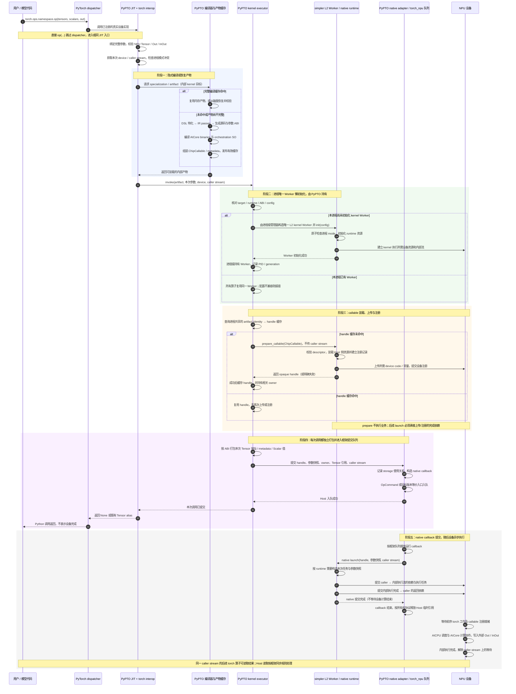
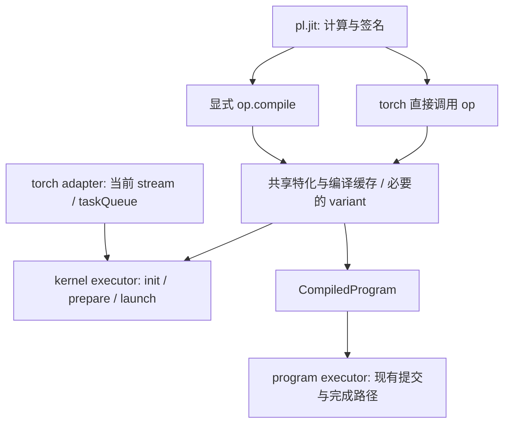
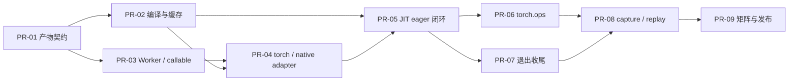

# PyPTO 正式 program / kernel 调用接口方案

日期：2026-09-14。版本：第四版，按用户澄清区分 program 显式编译入口与 torch 直接调用入口。状态：设计讨论稿，未实施功能；本轮不考虑 simpler pipeline。

本方案保留普通 `@pl.jit`，由调用入口在内部确定 program/kernel：torch 直接调用 JIT 算子走 kernel；program 显式编译取得对象后调用，或将产物提交给 program runner/Worker。普通 Scalar 是每次调用传入的数据；业务输入、Out、InOut 均来自调用方。torch 直接调用内部完成编译、初始化、加载和 prepare；program 显式编译后也可由可调用对象管理运行所需状态。普通调用不新增 context、handle、prepare、close 或执行 workspace 管理要求，现有高级 Worker 接口保留。

kernel 与 program 共用参数和编译产物契约，但保留各自的提交路径。正式支持目标覆盖 A2/A3、A5 与 HBG、TRB 的组合，以及 eager、ACLGraph；内部可以逐步实现，不能把某个 demo 或子集标为完整交付。

## 1. 输入依据与版本差异

| 资料 | 阅读与核对情况 |
| ---- | -------------- |
| [正式调用接口范围清单，固定版本](https://github.com/nalinaly/pypto/blob/4b917bca487567f4f475c6ddc1aa95249188b4d3/tests/pypto_formal_interface_change_scope.md) | 已全文阅读；用作正式接口设计输入；其中 JIT 显式 mode 已按用户反馈调整；simpler pipeline 按最新要求移出本轮范围 |
| vllm-call-flow.md（输入附件，未随本分支发布） | 已全文阅读；继续采用其职责划分、队列顺序和异步所有权分析；与新范围清单冲突的限制已改写 |
| [飞书纪要](https://hw-native-sys.feishu.cn/docx/Av8BdY7m3oVKUNxO5V9c7U3hnnH?dcuId=7612956330277473498) | 仍无法读取；不声称本稿已经逐条核对纪要原文 |
| 设计时核对的 PyPTO 基线 | `feat/kernel-mode-runtime-pin`，`04b607bec6a566fe4cafa7b65609a8dc9b4af687` |
| 设计时核对的 simpler gitlink | `748c39fbe7825e8411f44e91b754a3b2449f633c`；核对到的 onboard kernel 入口仍为 stub |
| 参考 fork | `nalinaly/pypto` 的 `4b917bca487567f4f475c6ddc1aa95249188b4d3`；另核对了该版本的 JIT/demo 代码 |

新文档是尚未实施的设计清单，不能据此判断依赖已经支持所有能力。它描述的 `_l1_allocate_outputs`、`execution="l1"` 等原型代码存在于参考 fork；当前工作区未发现对应 L1 文件。实现时按两个版本分别处理，不能直接把 fork 的行号当作当前分支的落点，也不能整体覆盖当前分支较新的持久缓存逻辑。

本文件是用于分享和讨论的设计稿；下列源码引用固定到设计时核对的版本，不表示本分享分支已实现相关功能。

### 1.1 对第一版的明确修正

| 第一版选择 | 本版结论 |
| ---------- | -------- |
| 模式选择 | 第二版曾采用 JIT 显式 mode；第四版按用户澄清固定为 torch 直调 kernel、显式编译对象调用 program，详见 2.3；不按失败情况切换 |
| 普通 Scalar 仍按值特化，`pl.RUNTIME` 才动态 | 假设 main 已完成普通 Scalar 默认运行时及显式常量分类；kernel 直接复用 |
| 普通调用必须传 raw stream | torch adapter 每次获取当前设备/stream；原生 ABI 每次传 stream，compiled 不固定首个 stream |
| capture 前强制 eager 预热，capture 内只准命中缓存 | 不预设禁止首次 capture；走内部 lazy 流程，实测并定位真实限制，不公开 prepare 仪式 |
| 第一阶段支持集收窄到一款硬件 + TMR | 可以按此顺序开发，但正式验收保留完整矩阵；HBG 和 A5 不是可选后续方向 |
| 同一设备禁止两种 mode 共存 | **同一进程**禁止 program/kernel runtime 共存；不同设备也不能绕过 |
| kernel 路径显式输出，program 调用完全不变 | 正式调用入口两种 mode 都要求外部输出；program 的底层 Worker/内存能力不作无关删除 |
| 外部 workspace 及图 owner 的显式收尾协议 | 不公开 per-op workspace/allocator/close；不新增追踪所有外部 graph 的管理系统 |
| 独立 `_torch_npu.py` 与若干平铺 runtime 模块 | torch 专属功能集中在 `python/pypto/torch/`；kernel 内部状态集中在 `runtime/kernel/` |
| 沿用旧编译器包装即可 | PyPTO 必须掌握算子编译与产物生命周期；simpler 提供 SDK/运行时服务 |
| 暂不规定注册容量 | simpler 目标规格为 8192 个驻留条目、2 GiB device code 上限、按需 2 MiB 粒度；不是执行 heap 容量 |

## 2. 正式接口与配置来源

### 2.1 用户持有算子或一个可调用编译对象

下面展示目标接口；torch 直接调用的 kernel 路径尚未在当前工作区实现。DSL 主体采用现有 tile_add 的组织方式，不包含独立 context 或手动注册。

```python
import pypto.language as pl

@pl.jit
def tile_add(a: pl.Tensor, b: pl.Tensor, c: pl.Out[pl.Tensor]):
    with pl.at(level=pl.Level.CORE_GROUP):
        ta = pl.load(a, [0, 0], [128, 128])
        tb = pl.load(b, [0, 0], [128, 128])
        pl.store(pl.add(ta, tb), [0, 0], c)

# torch / kernel：a_npu、b_npu、c_npu 已由框架分配。
tile_add(a_npu, b_npu, c_npu)  # 内部 lazy 编译，读取本次当前 stream

# program：在另一个进程中显式编译后调用。
compiled = tile_add.compile(a_host, b_host, c_host)  # 不 init runtime、不执行
compiled(a_host, b_host, c_host)  # program 执行
```

program runner/Worker 入口使用同样的正式绑定规则，但沿用 program 提交路径。允许在同一进程定义、分析和编译适用于两条路径的对象；只有进入真实 runtime 初始化时才认领进程 mode。

不增加 JIT 的 mode 参数。入口决定如何执行，JIT 声明描述计算；不再保留“JIT 直调 CPU Tensor 自动走 program”的第三版提案。不保留 `L1Context/L1Operator`、`execution="l1"` 作为第二套长期公共接口。

Out/InOut 必须完整传入，缺参在编译或执行副作用前报错。IR 里的 return 和 alias 信息继续保留：没有 return 的算子返回 `None`；若 IR 返回某个已有输出/输入的别名，可以返回同一外部对象。不能为了禁止输出分配，把所有 IR return 或别名都删除。

### 2.2 配置来源和冲突规则

| 信息 | 权威来源 | 调用时行为 |
| ---- | -------- | ---------- |
| 执行 mode | JIT 的 torch 直接调用入口固定 kernel；显式编译对象调用及 program runner/Worker 入口固定 program（2.3） | 先确定执行请求，再验证产物能力与进程 mode；不由缓存、capture 或初始化先后顺序决定 |
| runtime（HBG/TRB） | 统一规范化后的编译配置与产物 | 不能用另一 runtime 执行已有产物；名称归一化保持唯一来源 |
| 目标架构/ABI | 编译请求和产物 | 核对实际设备；不沿用默认 simulator 配置执行真实 NPU tensor |
| 当前设备/stream | 每次真实 torch 调用的 adapter | 编译对象不缓存 caller stream；init/prepare 不接收它 |
| Scalar 实际值、tensor 地址 | 本次参数 | ABI 编码后提交，不改变编译特化 |
| 显式常量、静态 shape/layout | 签名与编译请求 | 参与编译 key，按原有动态维表达排除动态部分 |

不复用现有 `runner.ExecutionMode` 表示 program/kernel，它当前用于设备执行/模拟执行。不新增 RunConfig mode 开关作为普通用户选路方式；已有配置用于目标/能力约束，不能覆盖入口语义。参考 fork 的 `_runtime_names.py` 在当前工作区不存在，需对接当前已有 RuntimeKind 的规范化机制，而不是制造并行的字符串常量表。

无需为普通 eager 调用先注册 torch custom op。`python/pypto/torch/registration.py` 服务 torch.compile、Fake/Meta 等高级集成；不把它做成普通直接调用的额外步骤。

### 2.3 两条入口自然决定模式

按用户澄清，program 需要显式编译取得对象，torch 可以直接调用。建议固定以下契约，不再根据 Tensor 在 CPU/NPU 上的位置选择模式：

| 调用入口 | 执行路径 | 编译与运行时机 |
| -------- | -------- | -------------- |
| `op(a, b, out)`，即 JIT 对象的 torch 直接调用 | kernel | 内部按需编译，adapter 读取当前设备/stream，然后 lazy init/prepare/launch |
| `compiled = op.compile(...)` | 仅编译 | 返回 program 可调用编译对象，不初始化 runtime、不执行业务 |
| `compiled(a, b, out)` | program | 使用已编译对象，内部对接现有 program 执行路径 |
| 将显式编译产物交给 program runner/Worker | program | 保留已有高级运行入口及其资源协议 |

program 显式编译也包括已有 IR 编译入口，不要求所有 program 都改写成 JIT 函数。恢复的 program 编译对象及多 orchestration 子对象保持相同的 program 调用语义。

CPU/NPU、Tensor 所有权、shape、dtype、stream 只用于校验既定入口的参数合法性。torch 直接调用收到 CPU Tensor 或 Worker 自有 DeviceTensor 时，报不受支持的参数并提示 program 的显式编译入口，不偷偷改变执行路径。纯 Scalar 直调也固定 kernel：若未来支持此类算子，其设备/stream 由 torch 当前执行上下文提供；缺少有效上下文则报错。多设备或混合 Tensor 仍需校验，不隐式搬运来满足入口要求。

**当前代码与目标契约须区分。** 当前 `JITFunction.__call__` 经 `_resolve_compiled` 后直接调用 `CompiledProgram.__call__`，两者最终都走 program。不能声称“当前 program 已经强制显式编译”。本轮设计将两条执行路径拆开，当前依赖 JIT 直接调用 program 的测试和示例需迁移到显式编译对象调用。

内部 before/after（伪代码，helper 名不是新增公开 API）：

```python
# Before：JIT 直接调用复用 program 对象的执行入口。
def jit_call(args):
    compiled = resolve_compilation(args)
    return compiled(*args)

# After：两个公开调用入口共享编译设施，分别进入明确的执行路径。
def jit_call(args):
    bound = bind_and_validate_torch_args(args)
    validate_process_mode("kernel")
    artifact = resolve_compilation(bound, execution_target="kernel")
    return kernel_executor.invoke(artifact, bound)

def jit_compile(signature_or_samples):
    # 编译 program 所需产物；不认领进程 mode，不执行算子。
    artifact = resolve_compilation(signature_or_samples, execution_target="program")
    return CompiledProgram(artifact)

def compiled_program_call(compiled, args):
    bound = bind_and_validate_program_args(args)
    validate_process_mode("program")
    return program_executor.invoke(compiled.artifact, bound)
```

init 前仍需 simpler 原子检查进程准入，前面的检查只用于提前失败。内部编译目标不作为 JIT 装饰器或普通调用的 mode 参数公开。两种入口使用同一份计算定义和特化设施；只有代码/ABI 确实不同的部分才区分 binary variant。JIT kernel 执行不能重新调用 program 对象的 `__call__`，也不以 Tensor 类型修改同一个 compiled 对象的调用语义。

kernel 用户入口仅为直接调用，编译及缓存恢复由内部完成；本方案不提供 kernel 显式编译、预填缓存或可调用编译对象接口。`op.compile(...)(...)` 明确属于 program。已有 device-free 编译辅助接口按 program 兼容范围另行盘点，不作为 kernel 使用流程的一部分。

eager/capture 不改变入口语义。编译 program 对象后仍可在该进程只执行 kernel，因为编译不初始化 program runtime；若已执行 program，再调用 torch kernel，则触发既定的进程模式冲突。这里无需全局 mode 配置，也没有“无 Tensor 则默认 program”的选择规则。

### 2.4 从 torch 算子调用到设备完成的完整执行过程

下图描述**目标 kernel eager 路径**。起点使用用户关心的 `torch.ops.<namespace>.<op>(...)`；namespace/op 名为占位符，前提是该算子已完成可选的 torch 注册。直接调用 `@pl.jit` 对象 `op(...)` 时跳过 dispatcher，进入同一个 PyPTO JIT 入口。Fake/Meta 或 tracing 阶段不执行此图中的 Worker 初始化和设备提交。

图中的 kernel Worker 由 PyPTO 按进程唯一创建并持有；同一进程的不同算子和 specialization 共用它，用户不传 Worker，也不调用 `.compile()`、prepare 或上传接口。这里选择先编译/恢复并校验产物，再初始化 Worker：目标架构来自编译请求及实际设备，runtime/ABI/config 由产物确定，编译失败也不会留下新初始化的 Worker。已有 Worker 时只做兼容性检查；配置冲突报错，不按算子、设备或 runtime 另建 Worker。初始化不接收 caller stream；本次 stream 只用于实际提交。



为展示异步窗口，图采用 taskQueue 延迟消费的例子；callback 也可能在 Python 返回前已执行。关闭 taskQueue 时，框架可能在提交线程直接运行 callback。两种情况下都不能把 Host 返回或 callback 结束当成设备完成。callback 内不触发 Python 编译、prepare，也不依赖 GIL。

阶段五只描述 kernel 接入需要的执行和依赖关系，不设计 simpler pipeline。AICPU/AICore 的协作节点也不意味着所有 runtime 都在 AICPU 运行同一份 orchestration：HBG 的 Host 构图与 TRB 的设备侧任务组织按各自正式 ABI 执行。不能把整份 ChipCallable 视为一块必须原样上传的设备内存；Host SO 与 device binaries 各自在适合的执行位置装载。

#### 编译、上传与执行分别何时发生

| 动作 | 首次完全冷调用 | 已有 Worker、新 specialization | 编译和 handle 均命中的后续调用 |
| ---- | -------------- | ------------------------------ | ------------------------------ |
| 绑定参数、取得当前 device/stream | 每次执行 | 每次执行 | 每次执行 |
| PyPTO 编译/恢复产物 | 缓存 miss 才编译；持久缓存 hit 则恢复 | 同左 | 复用内部产物 |
| PyPTO 创建并初始化 Worker | 本进程首次 kernel 执行时创建一个 | 新算子/新 specialization 复用同一 Worker | 复用同一 Worker |
| simpler 装载/上传/注册 callable | handle miss 时 prepare | 新产物 handle miss 时 prepare | 跳过 |
| 打包本次地址和 Scalar、adapter 入队 | 每次执行 | 每次执行 | 每次执行 |
| native launch 与设备计算 | 每次业务调用一次 | 每次业务调用一次 | 每次业务调用一次 |

编译缓存和 handle 缓存是两层：磁盘 binary 命中不代表当前进程已上传；Worker 已初始化也不代表该 callable 已注册。普通 Scalar 变值不产生新 specialization，换 caller stream 不重新注册。不同算子并发首次调用也必须经过同一个进程级初始化锁，只创建一个 Worker；同一 callable 的 prepare 另按 identity 做 single-flight；简化图中未展开等待者分支。

prepare 返回 handle 后，上传/设备注册可能仍在执行。simpler 必须通过其正式的流顺序或完成协议保证 launch 不会使用尚未就绪的资源；PyPTO 不能凭 handle 已返回便声称上传已完成。任一阶段失败都停止后续业务提交，错误携带具体阶段；不发布失败的缓存项，不通过执行一次业务来探测是否准备完成。

#### capture / replay 在完整过程中的位置

capture 时仍从同一个 torch/JIT 入口进入，框架记录实际 launch 的流依赖和设备工作；冷状态下的编译/init/prepare 按第 6 章逐项验证，不新增手动准备步骤，也不保证尚未验证的平台组合一定成功。上图中的“设备计算完成”阶段在 capture 路径上对应被记录、后续 replay 执行的工作，不能把 capture 返回视为计算已完成。

replay 路径为“框架 replay → 已捕获图的设备依赖与工作 → 写入 Out/InOut → 图完成”，不会重新经过 Python JIT、编译器、Worker 初始化、prepare 或逐算子的 Host callback。图中的参数地址和按值 Scalar 按捕获快照解释，生命周期规则见第 5.3、6 章。

## 3. Scalar、常量与动态 shape

**设计前提：假设 main 已完成 [#2751](https://github.com/hw-native-sys/pypto/issues/2751)，普通 Scalar 默认具有运行时语义。** 这是本方案采用的基线假设，不是对 issue 已关闭或代码已合入的状态声明。kernel mode 直接使用该主线能力，不承担其参数绑定、特化、缓存语义改造及兼容迁移。

### 3.1 直接复用的主线契约

- 普通 Scalar 保留为 IR/ABI 参数，每次执行使用本次传入值；值变化不改变编译 identity。
- Scalar 类型、位置及显式常量的分类由主线编译器提供，跨 JIT 子函数保持一致。
- 显式常量的语法、`pl.RUNTIME` 的兼容行为及未标注数值的推导规则，均沿用主线最终接口，本方案不另作设计。
- 主线已经处理相应缓存版本及旧语义迁移；kernel 接入只补充自身需要的执行能力/ABI 信息，不重复实现 Scalar 缓存迁移。

kernel 层负责消费主线生成的参数签名，按 ABI 打包本次 Scalar 值，并在异步 callback 使用前保持参数快照有效。主线能力与新提交路径的衔接通过第 3.2 节的集成测试验证。

### 3.2 两条入口共用 Scalar 语义，分别验证

对于参数 `step: pl.Scalar[pl.INT32]`，kernel 通过直接调用验证运行时值，不提供显式编译步骤：

```python
# kernel / torch：hidden、out、cache 为外部 NPU Tensor。
# csa 是已定义的 DSL 算子，以下为 eager 调用。
csa(hidden, out, cache, 0)  # 首次调用内部 lazy 编译、prepare，并执行一次。
csa(hidden, out, cache, 1)  # 复用内部编译产物与注册记录，使用本次 step=1。
csa(hidden, out, cache, 2)  # 使用本次 step=2，不使用首次调用的 0。
```

在静态 Tensor metadata、显式常量和编译配置不变时，以上三次调用应命中相同的内部编译 identity。测试通过内部编译/prepare 计数验证复用，不要求用户获取 kernel 编译对象。每次调用分别与 reference 对比，并验证 InOut cache 只更新一次，防止 lazy prepare 偷跑业务。

program 的显式编译规则在**另一个测试进程**中验证，与上面的 kernel 调用分开：

```python
# program：使用 program 入口支持的外部参数。
program0 = csa.compile(hidden_host, out_host, cache_host, 0)
program1 = csa.compile(hidden_host, out_host, cache_host, 1)
# 两次样本编译不执行算子；相同静态信息应复用 program 编译 identity。
program0(hidden_host, out_host, cache_host, 2)  # 实际运行使用 step=2。
```

两条路径共用“普通 Scalar 按本次调用值执行”的语义，不承诺两种模式共享相同二进制 identity，也不混用执行对象。program 的样本编译与签名编译应得到一致的 Scalar 参数签名。

kernel 用户直接传入本次 Scalar 值，无需占位符或 `.compile()`。program 签名编译及显式常量使用 main 已确定的接口；相关语法、兼容性和旧例子迁移不属于本次 kernel 接入工作。

### 3.3 HBG 的每次任务构建与 ACLGraph 参数快照

若运行时 Scalar 控制 HBG Host 任务数量或分支，例如本次 `step` 决定构建几个 task，那么每次 eager 调用必须使用本次值生成/绑定执行内容。不能缓存首次 Host 构建结果后只替换 tensor 指针。这里可能需要每次构建执行计划，**不等于重新编译算子**。

动态 shape 沿用现有 DynDim/注解与约束。动态维不进入静态编译 key，但每次调用仍校验合法范围和布局。

ACLGraph replay 使用捕获时的节点和参数快照。用户改变地址、shape 或 Python scalar，不表示已捕获图自动更新；PyPTO 不自动重新 capture。HBG 的 per-call Host 构建如何进入图，以及哪些参数在 replay 中固定，需要在每个 runtime/平台上记录真实行为。

## 4. 编译产物与已加载状态

### 4.1 共享编译设施，分离执行入口



torch 用户只持有 JIT 算子，内部 kernel executor 管理对应产物和加载记录；program 用户持有显式编译得到的 CompiledProgram，或沿用高级 Worker 提交。kernel 的加载记录归进程级管理器所有并引用唯一 Worker，不能由每个算子创建自己的 Worker；program 记录沿用现有所有权。`del compiled` 不是立即卸载承诺。

编译不初始化设备、不认领 runtime mode、不执行业务。仍区分 generated 与 binary-ready，必要的完整编译可由后续调用内部完成，但不能把 generated-only 对象宣称为已经可设备执行。现有 device-free `warmup()` 若保留，只在 program 兼容接口中说明其编译/组装语义；kernel 的用户流程不展示此接口，内部 lazy 状态不要求用户手动推进。

### 4.2 缓存和 metadata

建议沿用现有 JIT/持久缓存与 `_binary_cache.py`，调整 key/schema，而非新增另一套存储系统。

| 层 | 必须区分 | 明确排除 |
| -- | -------- | -------- |
| 编译 identity | 目标、HBG/TRB、ABI、静态 Tensor metadata、Scalar 类型/位置、显式常量、编译选项及来源；若 mode 改变代码或 ABI，再区分对应 binary variant | 运行时 Scalar 值、Tensor 地址、caller stream |
| 已装配 callable | 编译 identity、选定 orchestration、完整 binary/signature descriptor | 日志用短 HID 不能单独作为注册 identity |
| kernel 设备加载记录 | 产物 identity、PID、进程唯一 Worker 的 generation；device/runtime/config 用于一致性校验，不用于创建多个 Worker | 不落盘，不跨 fork/进程/context 重用 native handle |

拟产物 metadata 核心字段：

```json
{
  "schema": "<new version>",
  "supported_execution_modes": ["kernel"],
  "runtime": "host_build_graph",
  "platform": "a5",
  "abi_version": "<agreed version>",
  "params": [
    {"name": "out", "kind": "tensor", "direction": "out", "tensor_index": 0},
    {"name": "step", "kind": "scalar", "dtype": "int32", "scalar_index": 0}
  ],
  "return_aliases": []
}
```

这是字段草案，不是完整 JSON schema；shape/layout、其余参数与 binary inventory 复用现有描述。Tensor 和 Scalar 分池且各自保持签名顺序，不能把混合 Python 参数列表整体复制成 ABI。

[compiled metadata schema](https://github.com/hw-native-sys/pypto/blob/04b607bec6a566fe4cafa7b65609a8dc9b4af687/python/pypto/ir/compiled_program.py#L80)、持久 artifact identity、binary context 需一起考虑版本变化。能力字段描述经验证的产物兼容性，不是用户选择；示例只声明 kernel，不能未经 ABI 验证便声明双模式通用。旧产物通过明确的 schema 升级器恢复已知能力，或要求重编译，不能直接推定支持 kernel。`execute_artifact`、`from_dir`、多 orchestration 子对象都必须保留产物能力及必要的 binary variant 信息。共享 metadata 变更联动分布式对象格式，但不新增分布式 kernel mode。

### 4.3 编译责任不能只停留在命名上

当前 [KernelCompiler](https://github.com/hw-native-sys/pypto/blob/04b607bec6a566fe4cafa7b65609a8dc9b4af687/python/pypto/runtime/kernel_compiler.py#L11) 是 `simpler_setup.KernelCompiler` 子类，项目根、工具选择和 orchestration 编译等行为仍继承自 simpler。新边界需要 PyPTO 掌握输出目录、源码生命周期、编译动作和缓存发布；simpler SDK 提供头文件、目标编译参数与 runtime 信息。

建议先将 SDK 信息查询与算子 build orchestration 分开，再收回依赖继承的生命周期控制。允许复用纯工具功能，不要求复制整套工具链，不先做无关目录搬迁。AICore binary 与 orchestration SO 均由 PyPTO 生成和缓存；simpler 把它们上传/装载到设备，不改变编译所有权。

## 5. 内部 kernel 层与 PyTorch 层

### 5.1 目录与责任

| 拟新增/整理的目录 | 责任 |
| ----------------- | ---- |
| `runtime/_execution_mode.py` | 初始化时的进程 mode 准入、防重入及错误状态；不在 import/compile 时认领 |
| `runtime/kernel/context.py` | PyPTO 进程级管理器，唯一 Worker 的 lazy 初始化和强引用、共享 handle 表、配置一致性、并发等待与失败状态 |
| `runtime/kernel/callable.py` | 从编译产物取得加载记录、去重 prepare、构造每次调用的独立快照 |
| `runtime/kernel/abi.py` | simpler 正式接口适配、descriptor/参数长度类型方向与错误转换；不实现底层执行器 |
| `torch/__init__.py` | 必要公共接口导出；延迟加载 torch_npu 和 native 扩展，import 不初始化 Worker |
| `torch/interop.py` | Tensor dtype/shape/stride/format/device/pointer 校验与描述、本次 device/stream、Out/InOut 与 alias 校验 |
| `torch/launch.py` | 向 native adapter 提交 handle、参数快照、Tensor 与 Worker 保活引用；对接框架队列及内部退出协调 |
| `torch/registration.py` | 可选 torch.library/Fake/Meta/mutation/alias 集成，不作为 eager 前置要求 |
| 独立 `torch_npu_adapter` 扩展 | native callback、OpCommand/taskQueue、tensor 引用、recordStream，与通用编译器隔离 |

小文件可以合并；职责不回到一个巨大的 L1 demo。通用 runtime ABI 和编译代码不引用 torch_npu 私有头文件，也不为了框架分层新增 TVM-FFI 或通用插件机制。

#### python/pypto/torch/ 的具体功能与边界

以下为拟新增文件，不代表现有公共 API；首次实现按上述四个 Python 文件组织，native adapter 使用独立的可选 C++ 扩展构建目标。

- **`__init__.py`**：只导出最终确定的 torch 集成接口；按需加载 `torch_npu`/native 扩展。不在 import 时创建 Worker、注册设备资源或触发编译；无 torch_npu 环境仍可使用通用编译与 IR 功能。
- **`interop.py`**：读取并验证 Tensor 的 device、dtype、shape、stride、format 和逻辑起点地址；校验完整 Out/InOut 与 alias，构造借用 storage 的参数描述。每次真实调用取得当前设备和 caller stream，不固定首个 stream，不隐式搬运、转 contiguous 或分配缺失的业务输出。Scalar 类型及 ABI 位置沿用 main 已修复的签名；本层只转换本次值。
- **`launch.py`**：接收 `runtime/kernel/` 已准备好的 callable handle 和本次调用信息，交给 native adapter 提交。保证提交信息携带 Tensor 引用、参数快照及 Worker/native owner 引用。对接框架的提交与退出协调，但不创建 Worker、不执行 prepare、不维护另一份 handle 缓存，也不公开 close/shutdown。具体退出钩子遵循第 5.5 节的待验证契约。
- **`registration.py`**：提供可选的 `torch.ops` 注册支持，描述参数 schema、Out/InOut mutation、返回值和 alias；按目标 PyTorch 版本支持相应的 Fake/Meta 行为。Fake/Meta 只进行元数据推导和校验，不初始化 Worker、不 prepare、不提交设备工作。注册不是普通 JIT 直接调用的前置条件，也不默认提供 autograd；具体注册方式需验证对 mutation/alias 的支持。

**native adapter 的边界**：Python `launch.py` 负责调用衔接，可选 C++ 扩展负责 native 参数所有权、OpCommand/等价队列入口、callback 和 allocator 的 stream 使用记录。实际 simpler native launch 在 callback 中调用。Host 参数与 Tensor 引用必须覆盖延迟 callback 窗口，设备异步使用按 recordStream 或等价协议保护；具体要求见第 5.3 节。

```text
torch.ops 注册入口 / 普通 op(...)
  → torch.interop：参数校验与当前设备/stream
  → PyPTO JIT：隐式编译或缓存恢复
  → runtime/kernel：进程唯一 Worker、prepare、共享 handle 缓存
  → torch.launch + native adapter：框架队列、参数快照与异步保活
  → simpler native launch
```

公共入口的调度由 JIT/kernel executor 串接以上步骤；目录拆分不要求 `interop.py` 反向调用编译器。Worker 创建、持有、callable 注册与 close 的权威状态全部保留在 `runtime/kernel/`；torch 层只提供框架适配及生命周期协调。

对应验证包括：import 无 Worker 初始化；当前 stream 随调用变化；Tensor/alias 校验；`torch.ops` 与直接调用进入同一 kernel 执行路径；Fake/Meta 无设备副作用；延迟 callback 的参数与 storage 保活；退出时与唯一 Worker 管理器正确协调。编译、prepare 和生命周期验证复用第 10 章用例，不重复实现通用 Scalar 测试。

#### 进程级 Worker 与算子级 callable 的所有权

```text
进程 P：PyPTO 内部管理器（强引用持有）
  ├─ 唯一 kernel Worker W
  └─ 共享 callable 注册表
       ├─ op_A / specialization_0 → handle_A0，属于 W
       ├─ op_A / specialization_1 → handle_A1，属于 W
       └─ op_B / specialization_0 → handle_B0，属于 W
```

第一次真实 kernel 调用触发 Worker 懒创建与初始化；后续算子仅查询或新增自己的 callable 注册项。改变 Scalar 值或 stream 不新增 Worker；新算子或新 specialization 也不新增 Worker。管理器保持 Worker 的强引用，不依赖任何单个 JIT 算子对象的寿命；删除一个算子不关闭共享 Worker。

初始化锁覆盖进程内所有算子，handle 注册锁按 callable identity 去重，两者作用不同。已有 Worker 的 device/runtime/config 不兼容时明确报错，不通过另建实例绕过；本轮沿用每卡一个进程的部署方式，不引入每设备或每 runtime 一个 Worker 的注册表。不同 rank/进程分别由各自 PyPTO 管理器持有一个 Worker。

失败回滚和进程退出按统一生命周期协议处理；Worker 状态不确定时阻止继续提交，不由单个算子私自重建。fork 后禁止复用继承的 Worker/handle，子进程的可用性遵循底层 runtime 的进程初始化限制。program 的现有高级 Worker 接口不在此处重设计。

### 5.2 lazy 路径与热路径

从 torch 入口到设备完成的完整时序见第 2.4 节；下面仅展开 kernel executor 内部的简化职责。

```python
# 说明性伪代码，helper 名称不是已存在的公共 API。
def kernel_invoke(compiled, values):
    bound = compiled.signature.bind_all(values)  # 必须包含 Out/InOut
    frame = framework_adapter.describe_call(bound)  # 本次设备、stream、tensor 引用
    compiled.validate_target_and_configuration(frame)
    state = get_process_kernel_state()  # PyPTO 持有，所有算子取得同一状态
    worker = state.ensure_worker(compiled.runtime_config, frame.device)  # 进程唯一
    loaded = state.ensure_callable(worker, compiled)  # 按产物 identity 去重 prepare
    return framework_adapter.enqueue(loaded, bound, frame)
```

稳定签名和 dtype/方向 metadata 在创建 JIT/compiled 时预解析。热路径不反复解析签名、编译、准备相同 callable 或同步。runtime Scalar 值与 tensor 地址每次编码成独立快照，不能复用仍被延迟 callback 引用的可变 Host buffer。

init/load/prepare 的相同 key miss 由一个执行者处理，其他调用共享结果；成功后发布可用状态，失败回滚或保留明确失败状态。prepare 只是注册/资源准备，**绝不能调用一次业务算子做 warmup**，否则 InOut cache 会被额外修改。

可继续采用附件的 PyPTO 层 prepare 去重建议；但纯注册返回值、handle 布局等以冻结后的 simpler 正式 ABI 为准。PyPTO 保存映射不等于另造 device 注册器。

### 5.3 stream、外部 storage 与 native callback

每次真实 torch 调用获取当前设备/stream，compiled 不能固化第一次流；内部 init/prepare 无用户 stream，launch 才传本次流。获取 stream 的目标版本接口需证明不会隐式 drain 队列；不把 raw-stream 参数变成普通用户的必填项。

有序路径应为：torch A 入队 → PyPTO callback 入队 → torch B 入队。真正 native launch 在 PyPTO callback 中发生，不能裸 ACL launch 后补一个空命令。callback 不执行 Python 编译/prepare，不依赖重新取 GIL。

native adapter 接 simpler 正式可调用 native 接口，并在内部持有 owner/launcher 的有效引用；不固定上一版提出的 capsule/vtable 形态，更不自行解析 runtime DLL 私有符号。跨绑定 ABI、线程上下文、错误和所有权属于接入前必须冻结的细节。

外部 Tensor 至少覆盖以下窗口：Host 返回到 callback 结束由 native 参数副本和 Tensor 引用保活；callback 后的异步设备使用由正确 stream 上的 recordStream 或等价 allocator 协议保护。按唯一 storage 处理别名。它保护业务 Tensor，不是开放 runtime workspace allocator。

若部分 enqueue 失败且无法证明内部流已 join 回 caller，单靠 caller recordStream 不足以释放 storage。需按 simpler 的失败/完成协议持有在途引用、标记失效并传播错误；不能吞错、reset 外部设备或猜测已经安全。这个错误窗口的处理局限于 PyPTO 自己的调用，不扩展为管理所有外部 graph 的新系统。

### 5.4 输出、workspace 与所有权

业务输入、输出和 InOut cache 外部传入；正式入口不分配缺失业务输出。动态调度中的 heap、task window、中间 Tensor 与复用由 simpler 内部管理，没有 per-op workspace 查询、分配接口或外部 allocator 回调。

已有 program Worker 的 alloc_tensor 等管理业务 Tensor 的功能可以保留，不能与“不给算子暴露 workspace allocator”混淆。特定算子已有普通 scratch Tensor 参数是否属于业务接口，按其 DSL 签名处理；本方案不新增统一 workspace 参数要求。

不公开新的 close/shutdown。内部引用、缓存和 runtime 自有完成协议共同维持资源寿命，不承诺 Python GC 触发立即卸载，不销毁 caller stream、不 reset 借用设备。解释器退出时不通过已拆除的 Python 模块强制做全设备同步。

如果当前 runtime 尚不能可靠安全回收某类资源，应保守保留并记录容量/能力限制，继续完善 runtime 所有权协议；不把“用户手动保证所有图销毁再 close”追加为正式接口要求。Kernel task 每次必须有界完成，代码/资源驻留不等于 AICPU 常驻服务。

### 5.5 Worker close 的触发时机与退出顺序

**目标是在进程正常退出时，由 PyPTO 的进程级管理器统一执行一次安全收尾。** kernel Worker 从首次真实调用初始化后持续复用，不在单个算子返回、算子对象 GC、一次 capture/replay 结束或缓存项移除时关闭。普通用户不需要调用 close/shutdown。

安全退出顺序如下；它是需要在目标 torch_npu/simpler 版本上验证的生命周期契约，不代表当前依赖已具备可靠退出钩子：

```text
进程进入正常退出，PyPTO 管理器开始收尾
  → 停止接受新调用，协调正在进行的编译/init/prepare/提交
  → 框架停止新的 graph replay 提交
  → 排空已接受的 torch Host callback
  → 等待在途 eager 与 graph replay 的设备工作完成
  → 确认相关图不再使用 callable 资源，按底层协议完成图的释放
  → 调用唯一 Worker 的 close
  → close 成功后清空 handle 注册表及管理器持有的相关资源引用
  → torch/runtime 继续销毁队列、stream 和设备上下文
```

管理器内部采用幂等的收尾状态，重复通知不重复 close，也不能在收尾中重新创建 Worker。Worker 未初始化时无需关闭；部分初始化失败走对应回滚路径。close 失败保留失败状态及仍需存活的引用，不能发布“已安全关闭”的状态。

**不能直接将 `atexit(worker.close)` 当成完整实现。** 需要由 PyPTO 与框架的内部退出集成保证上述顺序，尤其是框架资源还有效、Host callback 已排空且不会再 replay。单纯阻止新的 PyPTO Python 调用并不能阻止已捕获图 replay；一次设备同步也不能保证之后没有新提交。具体退出钩子、执行线程及图资源释放顺序属于待验证的接入细节，不依赖 Python 模块的析构顺序碰巧正确。

若退出时框架上下文已拆除，或无法确认异步使用已经结束，不强行调用依赖这些资源的 close，也不提前释放仍在使用的 callable；保留到进程终止，由进程/驱动清理机制处理。异常终止不保证 Python 收尾执行。此回退不等于 close 已成功，驱动清理行为及资源释放结果需要在部署环境验证。

本方案不新增公开 close、要求用户配对 init/close，或建立追踪所有外部 graph 的管理系统。正常退出的安全收尾由内部生命周期集成负责；尚未完成该集成时，应明确记录限制，而不是将收尾条件转交普通算子用户。

## 6. capture 的正式处理方式

本版撤回“capture 内只读命中，冷调用提前拒绝”的产品规则，也不要求用户先调用 prepare 或业务 warmup 才能进入 capture。

允许普通接口在首次 capture 内进入 lazy init/load/prepare 尝试。实现仍须尊重实际 ACL/CANN 对分配、stream/event 和 capture 的限制：保留底层阶段与错误原因，控制失败回滚，不是假装所有操作天然 capture-safe。

建议以以下状态分别实测，而非用统一 `cache_only` 规则替代：

| 进入 capture 时状态 | 验证内容 |
| ------------------- | -------- |
| 尚未编译、未初始化 | 首次 JIT/装配/init/prepare 哪一步可完成，若失败记录实际 API/阶段及资源状态 |
| 内部缓存已有 generated 产物、binary 尚未就绪 | 验证 kernel 内部补编译与装配；测试以缓存夹具构造此状态，不要求用户调用 `.compile()` |
| binary 已就绪、尚未 prepare | 首次加载/注册与 capture 传播的真实限制 |
| callable 已加载 | 多节点、不同 scalar 快照、stream/event 传播与重复 replay |

如果需要 capture 状态查询，应放在 torch adapter/具体受限操作的诊断边界；不能据此自动退出 capture、偷偷执行业务、切 program、自动重新捕获或要求新的公开准备仪式。查出真实限制后修复对应内部操作；未通过的组合如实记为未支持/失败，而非改变范围宣称完成。

图 owner 仍是框架/使用者；改变 shape、地址、按值 scalar 或 Host task 结构后的图更新由其处理。PyPTO 不新增追踪所有外部 graph 引用、证明全进程设备静默的管理器。异步 replay 与其他调用共享设备资源的执行顺序由 simpler 保证，Python lock 无法覆盖 replay。

## 7. 进程级 mode 互斥

```text
UNCLAIMED → INITIALIZING(program) → PROGRAM
          → INITIALIZING(kernel)  → KERNEL
```

两个箭头竞争同一进程准入。定义、分析和 compile 不进入状态机。即使 program 在设备 0、kernel 在设备 1，也不允许同一进程同时初始化。普通 JIT、compiled、one-shot runner、显式 ChipWorker、分布式 Worker 初始化都须覆盖；simpler 对直接调用其入口的情况提供最终防护。

PyPTO 的状态机用于提早报错和协调初始化，不能取代 simpler 的权威状态。失败若完成回滚且 runtime 明确未认领，才可回到 UNCLAIMED；已经锁定 mode 或清理不确定时保留相应失效状态，不能伪装可改 mode。新的公开切换/close API 不在方案内。

PID/generation 与加载记录关联；fork 后不能继续使用继承的 native 状态。不同 rank 在各自进程初始化，不能通过继承 handle 复用注册资源。

两种 mode 的 runtime 测试用独立进程，不通过改 mode 复用一个测试 worker。program 沿用现有执行协议；本轮不设计 simpler pipeline，也不将其改造作为 kernel 接入的前置条件或验收项。

## 8. simpler 依赖与支持规格

### 8.1 simpler 向 PyPTO 提供的 kernel 接口

这里的“对外”指 **simpler → PyPTO**，不是要求 torch 算子用户直接调用 simpler。PyPTO 持有进程唯一 Worker；Python 侧负责 init/prepare，native adapter 的 callback 调用同一 Worker 对应的 native launch。下表采用附件中的 L2 Worker **目标签名**；当前 pin 的支持情况另见 8.2，不能把提案当成已经导出的 API。

| 目标接口 | 输入 | 输出 / 语义 | PyPTO 调用时机与约束 |
| -------- | ---- | ----------- | -------------------- |
| `Worker(level=2, execution_mode="kernel", device_id=..., platform=..., runtime=...)` | 设备、目标平台、runtime 身份；kernel 模式为 PyPTO 内部固定选择 | Worker 对象；构造与设备初始化分开 | 本进程第一次真实 kernel 调用，内部管理器只构造一个；后续算子共用，不向用户暴露 mode 参数 |
| `worker.init(config=...)` | 与编译产物一致的 context 固定配置；`config` 的正式名称/类型需冻结 | 成功返回 `None`，失败抛异常；创建 runtime 常驻资源及内部流 | 进程首次初始化一次；无 callable、无 caller stream，不执行业务、不 reset 外部设备 |
| `worker.kernel_mode_supported` | 无业务参数；能力查询的可用阶段由正式 ABI 定义 | `bool` 或正式能力描述；不能把单个 true 当成完整平台/runtime/capture 矩阵已通过 | 初始化/能力校验边界查询，避免热路径重复；能力获取本身不执行业务 |
| `worker.kernel_prepare_callable(chip_callable)` | PyPTO 编译并组装的完整 ChipCallable：代码、签名、目标/runtime/ABI 信息 | opaque callable handle；装载 Host 资源，上传所需 device code 并注册；不执行算子 | 进程共享 handle 表 miss 时调用；不接 caller stream，不要求 PyPTO 分配 callable ID；同一产物的去重由 PyPTO 完成 |
| `worker.kernel_launch(handle, args, caller_stream=...)` | 当前 Worker 的 handle、本次借用 Tensor 描述及按值 Scalar、当前 caller stream | 成功表示已提交，通常返回 `None`；不表示设备工作已完成 | 每次业务调用使用本次参数；torch 路径通过 callback 调用其 native 等价入口，不能在 Python 先 launch 再补队列 |
| `worker.close()` | 无业务参数；必须满足退出时序与线程约束 | 释放 Worker 自有资源，使 handle 失效；失败必须可诊断 | 由 PyPTO 按第 5.5 节统一收尾，普通用户不调用；不销毁借用的 caller stream，不 reset 外部设备 |

`kernel_prepare_callable` 的目标语义是纯注册：重复调用可以产生新的 handle，不要求 simpler 提供 lookup。PyPTO 的共享缓存保证同一产物不重复 prepare；失败不发布 handle。prepare 返回不等于设备上传已完成，simpler 必须建立注册到 launch 的就绪依赖。

`kernel_launch` 不接收 `eager/capture` 或 mode 参数，不重新编译、不重新选择 runtime。capture 诊断位于 PyPTO/框架适配边界；内部动态内存与资源回收由 simpler 管理，不增加 per-op workspace 查询、外部 allocator 或 pipeline 接口。

#### 参数对象与所有权

| 对象 | 必要内容 | 所有权与有效期 |
| ---- | -------- | -------------- |
| Worker 初始化配置 | platform/runtime/ABI 相容信息及固定资源配置 | PyPTO 从产物和部署配置建立；后续不兼容算子报错，不另建 Worker |
| ChipCallable | orchestration SO、AICore binaries、参数签名、目标/runtime、完整 identity 所需 metadata | PyPTO 生成并保持装载所需资源；simpler 拥有注册后的 runtime 资源。具体复制/借用边界必须由正式 ABI 说明 |
| Callable handle | opaque 注册标识及其 owner/generation 关联 | 仅属于创建它的 Worker；不解释为可跨 Worker 使用的裸整数，不落盘、不跨进程复用 |
| 每次 launch 参数（本文称 `KernelArgs`） | 每个 Tensor 的逻辑起点设备地址、dtype、shape、支持的 stride/layout、方向/别名信息，以及按声明 dtype 编码的 Scalar | PyPTO 在 callback 执行前持有独立快照；simpler 接收后按正式协议保存其所需参数。外部 Tensor storage 始终借用 |
| caller stream | 本次框架原生 stream 句柄 | 框架持有；init/prepare 不接收、不保存为默认 launch stream；每次 launch 显式传入 |

`KernelArgs`、配置字段与 native handle 包装是契约名称，尚不是可直接 import 的类型承诺。Tensor/Scalar 的分池与 ABI 位置由产物签名和 simpler 参数协议共同确定，不能将 Python 参数列表或浮点值随意转成整数数组。

#### native callback 可调用的边界

simpler 还需向 PyPTO 的可选 C++ adapter 提供 **Worker 对应的 native launch 入口及 owner 保活方式**。它与 Python launch 执行同一协议，不是一个接收 callback 的新调度器：

```text
PyPTO native callback
  → simpler 的受支持 native launcher(handle, args, caller_stream)
  → simpler 内部 runtime C ABI
  → CANN / 设备执行
```

正式 native 符号、类型和导出形式待双方冻结，本方案不杜撰一个已存在的 C++ 方法名。该入口必须允许在约定的 torch 队列 callback 线程执行、无需 Python/GIL，并明确错误返回、参数接收完成点、device 绑定要求及 owner 有效期。init/close 的线程要求与 launch 分开规定；PyPTO 不能因设置 DeviceGuard 就推定所有线程均可调用。

OpCommand/taskQueue 由 PyPTO adapter 和 torch_npu 管理。simpler 不接收 OpCommand、不替 PyPTO 构造 callback；PyPTO 不直接加载 runtime 私有符号，也不自行创建 DeviceContext 或维护 simpler 内部流。

#### 编译期 SDK 能力

为让 PyPTO 掌握编译生命周期，simpler 还需要提供稳定的 SDK 信息：公共头文件/库、目标及 runtime ABI 描述、必要的编译链接参数、callable/参数描述格式。这里列的是接入所需能力，具体查询 API 未冻结。PyPTO 使用这些信息生成代码与二进制；上传、注册和执行仍走上表。当前 `simpler_setup.KernelCompiler` 的继承关系及迁移见第 4.3 节，不假设已有一个新的 SDK 查询函数。

### 8.2 目标接口与当前 pin 的差异

本次核对仍以文首记录的 simpler gitlink 为基线，以下均为源码检查结果，未声称设备验证通过。

| 当前源码入口 | 已观察到的事实 | 与上述目标的差异 |
| ------------ | -------------- | ---------------- |
| [Worker 构造](https://github.com/hw-native-sys/simpler/blob/748c39fbe7825e8411f44e91b754a3b2449f633c/python/simpler/worker.py#L4626) | 当前为 `Worker(level=..., **config)` | 接收任意 config 不等于实现了 kernel execution_mode；当前 Worker 中未找到上述 kernel prepare/launch/能力属性 |
| [Worker.init](https://github.com/hw-native-sys/simpler/blob/748c39fbe7825e8411f44e91b754a3b2449f633c/python/simpler/worker.py#L7727) | 当前公开配置参数为 `prewarm_config` | 不能将目标签名 `init(config=...)` 当成现有可调用形式；kernel 的固定配置语义需正式接入 |
| [Worker.register](https://github.com/hw-native-sys/simpler/blob/748c39fbe7825e8411f44e91b754a3b2449f633c/python/simpler/worker.py#L6735)、[run](https://github.com/hw-native-sys/simpler/blob/748c39fbe7825e8411f44e91b754a3b2449f633c/python/simpler/worker.py#L11217)、[unregister](https://github.com/hw-native-sys/simpler/blob/748c39fbe7825e8411f44e91b754a3b2449f633c/python/simpler/worker.py#L7324) | 存在已有 program 注册、运行和注销接口 | 保留给 program；不能将其视为已支持借用 torch NPU Tensor 与 caller stream 的 kernel 接口 |
| [Worker.close](https://github.com/hw-native-sys/simpler/blob/748c39fbe7825e8411f44e91b754a3b2449f633c/python/simpler/worker.py#L11872) | 已有终止/失败清理协议；native teardown 要求 init-owner 线程 | kernel 生命周期及 torch 退出集成仍须核对；不能在任意 atexit 线程直接调用 |
| [runtime C API 声明](https://github.com/hw-native-sys/simpler/blob/748c39fbe7825e8411f44e91b754a3b2449f633c/src/common/worker/runtime_c_api.h#L600) | 已声明 `simpler_kernel_mode_supported/init/prepare_callable/launch`；旧 prepare 含外部 callable_id 与 caller_stream | 属于 simpler 内部底层边界；与“prepare 返回 opaque handle、无 stream”的 L2 目标不同，不要求 PyPTO 绕过 Worker 直接接旧接口 |
| [onboard C API 实现](https://github.com/hw-native-sys/simpler/blob/748c39fbe7825e8411f44e91b754a3b2449f633c/src/common/platform/onboard/host/c_api_shared.cpp#L1253) | `supported` 返回 0，init/prepare/launch 为未支持或无有效 kernel context 的错误路径 | 声明存在不等于 kernel 能力已接通；需要 simpler 正式实现后才能验收 |

因此实现前应冻结上述 Python/native 两侧契约并升级依赖，再执行对应集成测试。这里列出现有 program 接口仅用于区分复用边界，不展开 simpler 的全部多层 Worker、远程内存或调度 API。

### 8.3 支持规格与验收约束

| 契约 | PyPTO 对接方式与验收要求 |
| ---- | ------------------------ |
| init/prepare/launch | 两个准备入口无用户 stream，launch 带本次 stream；只准备、不额外执行业务 |
| 所有底层入口的进程 mode 防护 | PyPTO 与直接 simpler 初始化交叉测试；不同设备不能绕过 |
| native callback 支持 | 冻结 ABI、句柄所有权、callback 线程可用性及设备上下文要求；DeviceGuard 本身不是线程安全证明 |
| kernel 共享资源串行 | eager、多个 callable、不同 stream、graph replay 共享资源时由 runtime 建立实际设备依赖 |
| 动态中间内存 | runtime 管理申请/回收/复用与背压；PyPTO 不写分配器或向外导出 workspace API |
| 驻留代码容量 | 8192 条目，device code 总量不超过 2 GiB，按需 2 MiB 粒度申请；不固定预留 512 MiB 大 arena |
| 安全释放与错误 | 只处理自有资源；部分失败不能被吞掉，未证实完成的在途引用不能提前释放 |

代码容量与 task heap 分开统计；上限所属注册/执行域应写入 ABI。粒度涉及的取整计费、重复注册、失败回滚和第 8193 项需要边界测试，可先用计数/mock 验证，不要求每个 UT 真的分配 2 GiB。

当前 pin 的 `supported=0` 和 init/prepare/launch stub 是现状，不能通过忽略错误跳过。正式 ABI 发布和 runtime 实现是跨仓前置工作；新清单并未证明它们已经完成。之前文档中的旧容量数字、旧 prepare 参数和单平台 demo 不能替代这里的目标规格。

## 9. 文件改动与实施顺序

### 9.1 以当前工作区为基线的主要落点

| 文件/目录 | 具体改动 |
| --------- | -------- |
| [jit/decorator.py](https://github.com/hw-native-sys/pypto/blob/04b607bec6a566fe4cafa7b65609a8dc9b4af687/python/pypto/jit/decorator.py#L1922) | JIT 声明保持无 mode；JIT 直调固定进入 kernel；显式 compile 构建 program 对象；编译基础设施共享；直接/编译/compiled 同一参数契约；稳定签名预解析；完整输出绑定 |
| [jit/cache.py](https://github.com/hw-native-sys/pypto/blob/04b607bec6a566fe4cafa7b65609a8dc9b4af687/python/pypto/jit/cache.py#L60)、[specializer.py](https://github.com/hw-native-sys/pypto/blob/04b607bec6a566fe4cafa7b65609a8dc9b4af687/python/pypto/jit/specializer.py#L122)、[typing/scalar.py](https://github.com/hw-native-sys/pypto/blob/04b607bec6a566fe4cafa7b65609a8dc9b4af687/python/pypto/language/typing/scalar.py#L77) | 作为已具备的主线依赖直接复用；不在 kernel 接入中修改 Scalar 语义、常量语法或兼容规则 |
| [ir/compile.py](https://github.com/hw-native-sys/pypto/blob/04b607bec6a566fe4cafa7b65609a8dc9b4af687/python/pypto/ir/compile.py#L255)、[compiled_program.py](https://github.com/hw-native-sys/pypto/blob/04b607bec6a566fe4cafa7b65609a8dc9b4af687/python/pypto/ir/compiled_program.py#L634) | 产物能力/runtime/ABI metadata；输出不自动分配；CompiledProgram.**call** 保持 program 语义，kernel executor 独立接框架适配；装配和加载状态分离 |
| [backend/pto_backend.py](https://github.com/hw-native-sys/pypto/blob/04b607bec6a566fe4cafa7b65609a8dc9b4af687/python/pypto/backend/pto_backend.py#L543) | wrapper 和参数配置同步 Tensor/Scalar 顺序、类型、方向、alias、动态维及目标/runtime |
| [kernel_compiler.py](https://github.com/hw-native-sys/pypto/blob/04b607bec6a566fe4cafa7b65609a8dc9b4af687/python/pypto/runtime/kernel_compiler.py#L11)、[device_runner.py](https://github.com/hw-native-sys/pypto/blob/04b607bec6a566fe4cafa7b65609a8dc9b4af687/python/pypto/runtime/device_runner.py#L452) | PyPTO 主导编译、组装；拆清 SDK 查询与构建生命周期；保留 program 专用提交 |
| [execute_artifact.py](https://github.com/hw-native-sys/pypto/blob/04b607bec6a566fe4cafa7b65609a8dc9b4af687/python/pypto/runtime/execute_artifact.py)、`_binary_cache.py`、`_artifact_runtime.py`、`jit/_artifact_manifest.py` | 产物能力/variant/schema 贯穿重建和持久缓存，不存 native handle；沿用现有系统，不另造产物审计流程 |
| `runtime/_execution_mode.py`、`runtime/kernel/`（拟新增） | 进程准入、唯一 kernel Worker 管理及共享加载记录、正式 ABI 适配 |
| `python/pypto/torch/`（拟新增）、[task_interface.py](https://github.com/hw-native-sys/pypto/blob/04b607bec6a566fe4cafa7b65609a8dc9b4af687/python/pypto/runtime/task_interface.py)、[tensor_arg.py](https://github.com/hw-native-sys/pypto/blob/04b607bec6a566fe4cafa7b65609a8dc9b4af687/python/pypto/runtime/tensor_arg.py) | 新增 **init**/interop/launch/registration 四个模块及可选 native adapter；框架适配与 runtime Worker 状态分离；保留 program address-free、Worker-aware 路径 |
| [runtime/worker.py](https://github.com/hw-native-sys/pypto/blob/04b607bec6a566fe4cafa7b65609a8dc9b4af687/python/pypto/runtime/worker.py)、[runner.py](https://github.com/hw-native-sys/pypto/blob/04b607bec6a566fe4cafa7b65609a8dc9b4af687/python/pypto/runtime/runner.py#L224)、[runtime_base.py](https://github.com/hw-native-sys/pypto/blob/04b607bec6a566fe4cafa7b65609a8dc9b4af687/python/pypto/runtime/runtime_base.py) | 所有初始化入口的 mode 防护、正式参数契约及现有 program 路径兼容；不删除无关管理能力 |
| [python/bindings/CMakeLists.txt](https://github.com/hw-native-sys/pypto/blob/04b607bec6a566fe4cafa7b65609a8dc9b4af687/python/bindings/CMakeLists.txt)、[pyproject.toml](https://github.com/hw-native-sys/pypto/blob/04b607bec6a566fe4cafa7b65609a8dc9b4af687/pyproject.toml) | 独立 torch_npu adapter target 与安装；无 torch_npu 的编译/IR 环境继续可用 |
| `python/pypto/__init__.py`、`runtime/__init__.py`、`jit/__init__.py`、`language/typing/__init__.py` 等 | 只导出最终公共符号，lazy import；同步 typing，不公开内部 context/prepare/close |

若正式 wrapper 或 C++ ABI 改变，再精确联动 `src/codegen/orchestration/`、对应 include、nanobind codegen binding 和 `pypto_core/codegen.pyi`。共享 metadata/初始化改动需要 distributed 编译对象/runner 回归，但不增加分布式 kernel 功能。

Tensor/Scalar IR 定义、数学算子、tile/SPMD、依赖和 memory planning pass 不属于默认重写范围。

### 9.2 fork 原型如何复用

参考 fork 的 `execution="l1"`、`_l1_allocate_outputs`、`l1.py`、`l1_jit.py` 和 `torch_npu_l1_adapter.cpp` 属于原型，不是当前工作区已经存在的正式层。适合提取的是 taskQueue/recordStream、参数保活和有效回归经验，不复制手动 context、输出自动分配与旧 queue-call 契约。

如果将原型提交导入本分支，应先映射到正式目录/ABI；正式路径完成后删除 demo 公共导出和重复实现，不维持永久兼容层。当前分支没有的 demo 文件无需为了“退场”先引入一遍。历史诊断记录保留，仅标注原型身份；不批量改写历史，也不引入参考 fork 较旧的 JIT 实现覆盖现有持久缓存。

### 9.3 PR 拆分与依赖关系

以下 PR 编号仅表示本方案的提交批次，尚未创建这些 PR。所有 PyPTO 实现 PR 合入 `feat/kernel-mode-integration-test`，分支使用 `feat/kernel-mode-*` 等非 `codex/` 前缀。每个 PR 同步其行为对应的项目中英文文档和测试；最后一个 PR 负责总体验收，不将前面 PR 的基本验证留到最后。

**基线假设**：main 已完成 #2751，Scalar 绑定、特化、常量语法与缓存兼容直接复用；不单独安排修复 Scalar 的 PR。simpler pipeline 不在任何 PR 的内容或依赖中。vLLM/recipes 接线仍为后续工作。

**跨仓输入**：第 8.1 节的 simpler Python/native ABI、配置及线程规则需要冻结，并提供可验证的版本。PR-01 可先整理产物契约；PR-02 的 SDK 接线、PR-03 的 Worker 接线和 PR-04 的 native 接线分别依赖对应接口明确。无设备 UT 可以用契约替身验证 PyPTO 行为，但不能据此声称 simpler 已实现；PR-05 的真实 eager 闭环必须使用非 stub 的 runtime。首次升级 `runtime` gitlink 的 PR 记录确切 commit 与能力差异，不绑定一个仍移动的分支名。

| PR | 建议标题 / 交付结果 | 依赖 | 合入后的可用边界 |
| -- | ------------------- | ---- | ---------------- |
| PR-01 | 定义 kernel 产物能力与参数契约 | 已修复的 main 基线；simpler ABI 定义 | 编译产物能表达 kernel 兼容性；公共调用仍按现状执行 |
| PR-02 | 由 PyPTO 完成 callable 编译、组装和缓存恢复 | PR-01；simpler SDK | 可在不创建 Worker 的情况下生成可注册的内部产物 |
| PR-03 | 增加进程唯一 Worker 与 callable 注册管理 | PR-01；simpler Worker API | 内部管理器支持唯一 init、去重 prepare 和状态防护 |
| PR-04 | 增加 torch 参数适配与 native 队列提交 | PR-02、PR-03；simpler native API | 内部桥接可提交真实 callable；还不切换普通 JIT 入口 |
| PR-05 | 接通 JIT 直接调用的 kernel eager 路径 | PR-02、PR-03、PR-04 | `op(...)` 完成 eager 闭环；`op.compile(...)(...)` 保持 program |
| PR-06 | 增加可选 torch.ops 注册与 Fake/Meta | PR-05 | `torch.ops` 与直接调用复用同一 kernel 执行路径 |
| PR-07 | 完成进程退出的 Worker 收尾集成 | PR-05；已验证的框架退出契约 | 正常退出安全 close；失败和异常退出行为明确 |
| PR-08 | 接通并验证 ACLGraph capture/replay | PR-06、PR-07；simpler 图执行能力 | 两类入口覆盖冷 capture、热 capture 与 replay |
| PR-09 | 补齐完整平台矩阵、分支 CI 与正式示例 | PR-08 | 正式范围的逐项验收结果齐备，可按支持矩阵发布 |



PR-02 与 PR-03 可在契约明确后独立开发；PR-06 与 PR-07 也可独立开发。每个 PR 以已合入的依赖为基线，不依赖尚未合入的另一个 PR 才能通过自己的检查。PR-01～04 不提前改变用户调用选路，不新增临时公开 mode 开关；PR-05 一次性完成入口切换及受影响用例迁移。

### 9.4 每个 PR 的具体内容

#### PR-01：定义产物能力、参数绑定与持久格式

**结果**：明确“编译产物能在哪种执行路径使用”以及参数 ABI；保持主线 Scalar 语义和现有公开执行路径。

具体改动：

1. 为内部编译请求和产物 metadata 增加第 4.2 节的执行能力/ABI 信息；只有经过 ABI 核对才允许共享 program/kernel binary，不能对旧产物默认声明支持 kernel。
2. 提取共享的完整参数校验能力，能够要求全部 Out/InOut，并保留 IR return/alias。这里提供内部校验设施；正式入口的输出行为切换统一留到 PR-05，避免只改一半调用链。
3. 联动 `from_dir`、多 orchestration 子对象、generated/binary-ready manifest 的保存与恢复。旧 schema 使用明确迁移器或报重编译；错误不得导致自动执行另一 mode。
4. 内存及持久 identity 增加确实影响代码/ABI 的字段；不重写主线 Scalar 分类，不把地址、stream 或 runtime Scalar 值放回编译 key。

主要文件：[ir/compiled_program.py](https://github.com/hw-native-sys/pypto/blob/04b607bec6a566fe4cafa7b65609a8dc9b4af687/python/pypto/ir/compiled_program.py#L634)、[ir/compile.py](https://github.com/hw-native-sys/pypto/blob/04b607bec6a566fe4cafa7b65609a8dc9b4af687/python/pypto/ir/compile.py#L255)、`jit/_artifact_manifest.py`、`jit/_persistent.py`、`runtime/_artifact_runtime.py`、`runtime/execute_artifact.py`；确有编译 identity 差异时调整 `jit/cache.py`。复用现有模块，不为一份 schema 创建第二套缓存系统。

前后示意：

```python
# Before: recovery cannot establish kernel compatibility from an explicit contract.
artifact = restore_existing_metadata(path)

# After: illustrative internal helper names.
artifact = restore_versioned_metadata(path)
artifact.require_compatible_execution("kernel", runtime_abi)
bound = bind_complete_args(artifact.signature, values)  # Out/InOut included
```

**验收**：`tests/ut/ir/test_compiled_program.py`、`test_compile_pipeline.py`、`tests/ut/jit/test_artifact_cache.py`、`tests/ut/runtime/test_execute_artifact.py` 验证新格式往返、旧格式处理、能力冲突、alias 和缺参诊断；program 和 distributed 恢复回归通过。编译和恢复不 init Worker，不执行业务。项目文档加入产物字段及版本规则。

#### PR-02：PyPTO 掌握编译、组装与缓存恢复

**结果**：JIT 内部取得完整 ChipCallable，不依赖设备 Worker 完成算子编译。

具体改动：

1. 梳理 `KernelCompiler` 当前从 `simpler_setup.KernelCompiler` 继承的工具选择、源码管理、编译与链接行为；将 SDK 信息消费与 PyPTO build 生命周期分开，逐项列出替换关系。
2. 接通 kernel 内部编译请求，复用 specialization、IR passes 和代码生成，产出 orchestration SO、AICore binaries 与正确 descriptor。按 runtime 确认 Host/device 资源位置。
3. 复用现有生成态/完整二进制态缓存，磁盘完整命中不再次调用编译器；生成态命中只补缺失二进制。失败不发布完整产物，保留并发构建与只读恢复契约。
4. 仅当正式 ABI 要求不同 wrapper 时修改 codegen；列出参数池、标量类型/位置及返回别名的差异，不默认重写 pass 或 IR。

主要文件：[runtime/kernel_compiler.py](https://github.com/hw-native-sys/pypto/blob/04b607bec6a566fe4cafa7b65609a8dc9b4af687/python/pypto/runtime/kernel_compiler.py#L11)、[runtime/device_runner.py](https://github.com/hw-native-sys/pypto/blob/04b607bec6a566fe4cafa7b65609a8dc9b4af687/python/pypto/runtime/device_runner.py#L452)、`runtime/_binary_cache.py`、`runtime/_artifact_runtime.py`、`jit/_toolchain.py`、[backend/pto_backend.py](https://github.com/hw-native-sys/pypto/blob/04b607bec6a566fe4cafa7b65609a8dc9b4af687/python/pypto/backend/pto_backend.py#L543)。C++ codegen 确有接口变化时才同步 include、binding 与 stub。

```python
# Target internal behavior; no public kernel compile() entry is added.
artifact = resolve_kernel_artifact(request)
chip_callable = assemble_chip_callable(artifact)
assert process_worker_was_not_initialized()
```

**验收**：沿用 `tests/ut/runtime/test_prebuilt_artifact.py`、`test_binary_cache_context.py`、`tests/ut/jit/test_artifact_cache.py` 与 codegen signature 测试；覆盖完整命中、部分命中、缺失/损坏产物和并发发布。至少一份真实 DSL 产物完成目标工具链编译及 descriptor 校验。此 PR 证明可编译，不宣称设备执行或 capture 已通过。

#### PR-03：进程唯一 Worker、模式防护与 callable 注册

**结果**：不同算子共享一个 PyPTO 持有的 kernel Worker，按产物去重上传注册。

具体改动：

1. 新增进程级管理器，区分未初始化、初始化中、可用、失败与关闭状态；所有算子共用初始化锁和 Worker 强引用，校验 PID、device、runtime/config。
2. 对接第 8.1 节正式 `init/prepare/close` 和能力查询；需要时升级 runtime gitlink。已有 Worker 配置不兼容则报错，不按设备/runtime/算子新建 Worker。
3. 建立进程共享的完整 callable identity → handle 表；同 identity 并发 prepare 只执行一次，失败不发布，handle 不落盘。每个注册项持有必需 owner。
4. 实现 program/kernel 初始化互斥的 PyPTO 提前检查，并验证 simpler 的最终防护；覆盖直接 program runner/Worker 等初始化入口。
5. 建立内部终止和清理原语，遵守 init-owner 线程约束；此时不注册一个未经验证的裸 `atexit` close。框架退出串接留给 PR-07。

拟新增 `runtime/_execution_mode.py`、`runtime/kernel/__init__.py`、`runtime/kernel/context.py`、`runtime/kernel/callable.py`、`runtime/kernel/abi.py`；调整 `runtime/worker.py`、`runtime/runtime_base.py` 的初始化边界。注册表由管理器拥有，`callable.py` 提供操作，不形成两份权威状态。

```python
state = get_process_kernel_state()
worker = state.ensure_worker(config, device)
handle_a = state.ensure_callable(worker, artifact_a)
handle_b = state.ensure_callable(worker, artifact_b)
# Both handles belong to the same worker; artifact_a repeated reuses handle_a.
```

**验收**：新增 `tests/ut/runtime/test_kernel_context.py`、`test_kernel_callable.py`、`test_execution_mode.py`，验证跨算子并发 init 计数为 1、同产物 prepare 计数为 1、不同产物各注册一次、失败传播、线程/PID/配置冲突和内部终止状态。契约替身测试与 simpler 实际 ABI smoke 分开记录，不能因 mock 通过就忽略 runtime stub。

#### PR-04：torch 参数适配与 native 队列桥接

**结果**：给定已准备好的真实 callable，PyPTO 能经 torch 有序提交路径执行并正确保持资源有效。

具体改动：

1. 新增 `torch/__init__.py`、`torch/interop.py`、`torch/launch.py`；校验 NPU Tensor、完整输出、alias/stride/format，逐次取得当前 device/stream，打包主线签名中的 Scalar 值。
2. 新增独立可选 native adapter；拟放在 `python/bindings/torch/torch_npu_adapter.cpp`，具体位置遵循实施时 CMake 组织。Python 入口传 handle、owner、参数快照及 Tensor 引用。
3. callback 使用 simpler 正式 native launcher，不执行 Python/JIT/prepare；OpCommand 或目标版本等价接口保证框架提交顺序。taskQueue 开关均使用相同业务语义。
4. Tensor 和参数保活覆盖 Host 延迟窗口；正确记录 allocator 的 stream 使用，处理别名 storage 和部分 enqueue 失败。缺少参数、错误布局不能通过隐式复制或输出分配补齐。
5. 延迟加载 native 扩展，普通 import/IR 编译不要求 torch_npu；缺少扩展时真实 kernel 执行给出明确错误。

主要文件：上述三个新 Python 文件、拟新增 native 源文件、[python/bindings/CMakeLists.txt](https://github.com/hw-native-sys/pypto/blob/04b607bec6a566fe4cafa7b65609a8dc9b4af687/python/bindings/CMakeLists.txt)、[pyproject.toml](https://github.com/hw-native-sys/pypto/blob/04b607bec6a566fe4cafa7b65609a8dc9b4af687/pyproject.toml)、`runtime/kernel/abi.py`。构建参数和目标版本的兼容范围随 PR 文档记录。

```python
frame = torch_interop.describe_call(bound)
# launch.py delegates ownership and enqueue to the native adapter.
torch_launch.enqueue(loaded_handle, bound, frame)
# Submission success is not device completion.
```

**验收**：新增 `tests/ut/torch/test_interop.py`、`test_launch.py`；在 `tests/st/runtime/kernel/` 增加 A → PyPTO → B 顺序、非默认 stream、taskQueue 开关、延迟 callback 快照、GC 后 allocator 压力与错误注入。至少使用 PR-02 生成的一份真实 DSL callable 做桥接验证，手写 callable 只作 ABI 单测。公共 JIT 路径暂不切换，内部桥接由测试驱动。

#### PR-05：切换 JIT 直接调用，形成真实 eager 闭环

**结果**：用户通过普通 `op(...)` 调用 kernel；显式编译对象继续走 program，整个 kernel 过程无需公开 mode、compile、Worker 或 prepare。

具体改动：

1. 修改 `JITFunction.__call__`，复用隐式编译和缓存，取得内部产物后进入 kernel executor；不再调用 `CompiledProgram.__call__` 执行 kernel。
2. 保持 `JITFunction.compile`/IR compile 返回 program 编译对象；`CompiledProgram.__call__`、恢复对象及子 callable 保持 program 语义。
3. 在两种正式入口统一要求外部 Out/InOut，停止自动分配缺失业务输出，保留返回别名。明确缺参和不支持 CPU/DeviceTensor 的 kernel 诊断，不按参数位置静默切换 mode。
4. 将依赖旧 JIT 直调 program 的 UT、ST、examples 改为显式编译后调用；按用例意图迁移，不能把所有 CPU 测试机械改成 NPU 测试。新的 kernel 测试使用真实 NPU Tensor。
5. 接通进程共享 Worker、产物及 handle 缓存计数，验证首次调用只执行业务一次；跨算子调用和新 specialization 只增加必要注册。
6. 第一批 eager 支持组合明确列入文档；未验证的目标仍保留在第 10 章正式矩阵中，不将此 PR 作为全平台或 capture 交付。

主要文件：[jit/decorator.py](https://github.com/hw-native-sys/pypto/blob/04b607bec6a566fe4cafa7b65609a8dc9b4af687/python/pypto/jit/decorator.py#L2618)、[ir/compiled_program.py](https://github.com/hw-native-sys/pypto/blob/04b607bec6a566fe4cafa7b65609a8dc9b4af687/python/pypto/ir/compiled_program.py#L634)、`runtime/kernel/callable.py`、`torch/interop.py`、`torch/launch.py`；`runner.py` 和 `device_runner.py` 仅保留必要的 program 路径接线。受影响测试/示例通过搜索直接调用及 return-style 用法形成明确迁移清单，随 PR 描述提交。

```python
# Before: direct calls eventually execute through CompiledProgram.
compiled, args, config = self._resolve_compiled(args, kwargs)
return compiled(*args, config=config)

# After: illustrative dispatch after the existing compilation/cache machinery.
artifact, bound, frame = resolve_kernel_call(args, kwargs)
return kernel_executor.invoke(artifact, bound, frame)

# Program users explicitly compile, then call the returned object.
program = op.compile(*samples)
program(*runtime_args)
```

**验收**：`tests/ut/jit/test_decorator.py`、`tests/ut/ir/test_compiled_program.py`、`tests/ut/runtime/test_chip_worker_explicit_dispatch.py` 等相关 program 回归；新增 `tests/st/runtime/kernel/test_jit_eager.py`、`test_inout_scalar.py`、`test_multi_callable.py`。至少完成 tile add 和一次真实 InOut 更新：多次 Scalar 变值使用本次值、compile/init/prepare 次数正确、多个算子共享唯一 Worker。程序模式与 kernel 模式在隔离进程执行。

#### PR-06：torch.ops 注册与 Fake/Meta 集成

**结果**：用户既可以直接 `op(...)`，也可以经已注册的 `torch.ops` 调用同一条 kernel 路径。

具体改动：

1. 新增 `torch/registration.py`，从已有参数签名提取 schema 所需信息，明确 Out/InOut mutation、返回类型及 alias 关系；拒绝当前集成无法正确表达的 schema。
2. 注册实际设备实现到 PR-05 的 JIT/kernel 入口，不维护第二份 Worker、编译缓存或执行器。
3. 添加 Fake/Meta 实现，按既定输出/alias 契约推导与校验 metadata；不创建 Worker、不 init/prepare/launch，不产生真实设备副作用。
4. 定义重复注册、名称冲突及模块重复 import 的行为；使用目标 PyTorch 支持的注册路径，不以 raw dispatcher 注册成功替代 torch.compile 行为验证。
5. 明确没有 backward 时的行为，不隐式承诺 autograd。注册辅助的具体公开函数名在本 PR 定稿并同步导出/文档，示例中的 namespace 仅为示意。

主要文件：拟新增 `python/pypto/torch/registration.py`，调整 `torch/__init__.py`，必要时复用 `interop.py` 的 metadata 校验；新增 `tests/ut/torch/test_registration.py` 和 `tests/st/runtime/kernel/test_torch_ops.py`。

```python
# After registration through the agreed helper:
torch.ops.pypto_example.tile_add(a, b, out)
# Calls the same kernel path as tile_add(a, b, out).
```

**验收**：真实 `torch.ops` 与普通 JIT 的结果、Worker identity 和 handle 复用一致；schema 正确标注写入与别名；Fake/Meta 执行的 init/prepare/launch 计数全为 0；重复注册/冲突明确；至少一个目标版本上的 torch.compile/Fake 路径检查通过。torch.compile tracing 与 ACLGraph capture 分别记录，不能混为同一能力。

#### PR-07：进程退出的安全收尾

**结果**：PyPTO 的进程级管理器在框架依赖仍有效时关闭唯一 Worker，算子用户无需手动 close。

具体改动：

1. 在 PR-03 的管理器中接入幂等收尾状态，阻止新调用，并协调进行中的 init/prepare/提交；单个算子 GC 不触发收尾。
2. `torch/launch.py` 与框架的内部退出通知协调 Host callback 排空、设备完成及停止新 replay。选定的钩子及目标版本顺序需有证据，不能仅加 `atexit(worker.close)`。
3. 按 simpler 的 init-owner 线程规则调用 close；图资源不会再访问 callable 后才释放 Worker，成功后清空 handle 表。
4. 明确未初始化、部分初始化失败、重复通知、close 失败、框架已经拆除及异常终止的处理；不把“开始关闭”当作“安全释放完成”。
5. 不实现追踪所有外部 graph 的新管理系统。退出顺序无法保证时保留到进程终止，并记录限制；不能因此宣称正常显式 close 已验证。

主要文件：`runtime/kernel/context.py`、`runtime/kernel/callable.py`、`torch/launch.py`、native adapter 的 owner 保活部分。代码位置跟随已有模块，不增加用户生命周期 API。

```text
READY → STOPPING → 排空 Host callback / 在途设备工作
                 → 框架图资源停止使用 callable
                 → owner 线程 close → CLOSED
失败或顺序不确定：保留失败/退出状态与必要引用，不重新创建 Worker
```

**验收**：新增 `tests/ut/runtime/test_kernel_shutdown.py`，使用独立子进程验证多算子只 close 一次、未初始化零 close、线程约束、延迟 callback、重复退出通知及失败状态。设备集成验证 eager 工作排空和框架拆除顺序；graph teardown 协议可先以替身验证，PR-08 补真实 capture/replay 的退出测试。若目标框架暂无可靠钩子，需修复内部集成或将正常 close 明确记为未完成，不能通过要求用户手动关闭来验收。

#### PR-08：ACLGraph capture/replay 与图生命周期

**结果**：同一 kernel 调用入口可进入 capture，并由框架 replay 已捕获的设备工作；不增加显式准备步骤。

具体改动：

1. 在 torch adapter/受限操作的诊断边界接入 capture 状态信息，保持同一 device/stream 上下文；mode 不因 eager/capture 改变。
2. 逐项验证冷状态中的隐式编译、Worker init、资源装载、prepare 和 launch。发现受限操作时修复其内部路径或与 simpler 配套修复，不增加统一的“先 eager/prepare”规则。
3. 验证 caller 与内部流的进入/返回依赖、多个 callable 与不同 stream 的执行顺序；graph replay 不回 Python，不能依赖 Python 锁保证设备资源串行。
4. 明确 Tensor 地址与按值 Scalar 的捕获快照；不自动改变图参数或重新 capture。HBG Host 构图的真实可捕获行为需要单独验证。
5. 补齐 PR-07 的真实图生命周期测试：在途 replay 未完成时不释放、框架停止 replay 后正确关闭、依赖拆除顺序一致。
6. 失败保留阶段/API/资源状态，不退回 program，不隐式退出 capture；每个失败组合保留为验收缺口。

主要文件：`torch/interop.py`、`torch/launch.py`、native adapter、`runtime/kernel/context.py`、`runtime/kernel/callable.py`；只有对接协议变化时修改 `abi.py`/runtime gitlink。新增 `tests/st/runtime/kernel/test_capture.py`、`test_replay.py`、`test_graph_shutdown.py`。

```python
# Target behavior; graph setup and tensors belong to the caller.
with torch.npu.graph(graph):
    op(a, b, out)  # No user compile(), prepare(), or mode argument.
graph.replay()
```

**验收**：尚未编译/未初始化、内部 generated 缓存、binary-ready 未注册、已注册四种起始状态分别在隔离进程测试。至少覆盖直接 JIT 和 torch.ops 两种入口，多节点、多次 replay、不同参数快照、stream 顺序与图退出。冷路径失败保留实际证据且不标为通过；完整平台覆盖在 PR-09 汇总，但已发现的正确性问题必须在交付前解决。

#### PR-09：完整平台验收、分支 CI 和正式示例

**结果**：kernel mode 的正式支持范围可复核，后续合入目标分支的 PR 自动检查相关功能。

具体改动：

1. 将第 10 章 A2/A3、A5 × HBG/TRB × eager/capture/replay 参数化为统一用例矩阵。A2、A3 实机结果分别记录；每个进程只用一个固定 device/runtime 的 Worker。
2. 延续当前 `kernel-mode-ci.yml` 中的静态检查和 clang-tidy，逐步加入相关 UT、可选 native 扩展构建检查及定向设备任务；以 `feat/kernel-mode-integration-test` 为 PR 目标分支过滤条件。
3. 硬件 runner 接入前列出实际可用标签、依赖版本和每个矩阵单元的调度方式，不在文档里杜撰 runner 标签。未运行、缺少硬件、stub、测试失败与通过分别报告；最终汇总检查不因必验 job 被跳过而通过。
4. 检查 8192 注册条目、2 GiB 上限及 2 MiB 粒度的 simpler 协议测试证据；PyPTO 侧验证异常传播、去重和失败无假 handle，不在普通 UT 中强制分配完整容量。
5. 新增正式直接调用、torch.ops、InOut Scalar、capture/replay 示例；program 示例使用显式编译。按 PR-05 迁移清单清理重复 demo 导出，仅处理实际存在的原型文件，历史记录保留身份说明。
6. 汇总冷编译/init/prepare 与热提交开销、重复编译/注册计数和执行正确性。记录环境与基线，不引入无依据性能阈值或自动调优目标。

主要文件：`.github/workflows/kernel-mode-ci.yml`、`tests/st/runtime/kernel/`、`tests/ut/torch/`、`tests/ut/runtime/`，以及拟新增 `examples/runtime/kernel_mode/` 示例目录和 `docs/en/dev/runtime/kernel-mode.md` / 中文对应文档。正式文档同步各 PR 已交付能力，不把当前个人方案直接复制到仓库充当使用说明。

```text
PR base = feat/kernel-mode-integration-test
  → 现有静态检查 / clang-tidy
  → 无设备 UT + 可选 adapter 构建
  → 定向硬件矩阵
  → 汇总必验结果（未覆盖不等于通过）
```

**验收**：所有必验组合有实际成功记录、正确的依赖版本及可重复命令；program 编译/执行回归通过；正常退出与异步错误路径完成验证；文档示例无用户 mode/Worker/prepare/close 仪式；没有因例外跳过而宣称完整支持。硬件或 runtime 能力缺口使正式交付保持未完成，但不妨碍已独立验证的基础 PR 先合入集成分支。

### 9.5 每个 PR 的提交与验证约定

- PR 描述固定包含：本次触发条件与前后行为、受影响文件、依赖的已合入 PR / simpler commit、执行过的验证及未覆盖范围。只引用本 PR 已实现的能力，不将后续阶段的设计写成现状。
- 文档、相关 UT 与必要的 native/设备测试随实现 PR 提交。PR-01～04 的内部接线不能提前宣称用户入口可用；PR-05 eager 可用不代表 ACLGraph 或全部平台通过。
- 按 repository testing 工作流加载机器资源限制，使用明确的构建/测试并发；每个 PR 运行相关检查，本地只跑定向 ST，全矩阵由已配置的 CI 执行。
- 相关检查通过后再进入后续依赖 PR；若对 ABI、对象寿命或缓存 schema 作新修改，回归直接受影响的先前契约，不无目的重复全量测试。
- 以上为设计拆分；本分享分支只发布方案，不包含功能实现。

## 10. 验收矩阵与测试设计

### 10.1 kernel 正式目标

| 平台族 | runtime | eager | ACLGraph capture/replay |
| ------ | ------- | ----- | ----------------------- |
| A2/A3 | HBG | 必验 | 必验 |
| A2/A3 | TRB | 必验 | 必验 |
| A5 | HBG | 必验 | 必验 |
| A5 | TRB | 必验 | 必验 |

共 8 个平台族/runtime/执行方式单元。A2、A3 的实机结果分别记录。以上是目标，不是通过清单。program 另开独立 mode 记录同样维度的能力/回归状态；现有 program 能力与 kernel 验收分别记录，不能转到 kernel 填表。

### 10.2 关键断言与文件范围

| 测试 | 可观察断言 | 落点 |
| ---- | ---------- | ---- |
| 入口分派全链路 | JIT 直调固定 kernel；compiled/runner 固定 program；CPU/DeviceTensor 不能触发直调回退；纯 Scalar 不改入口；编译不认领进程；恢复对象保持 program 语义 | `tests/ut/jit/`、`tests/ut/ir/test_compiled_program.py`、`test_compile_pipeline.py` |
| runtime Scalar 接入 | 复用主线签名与缓存；kernel 连续传入 0/1/2 时不重复编译/prepare，实际执行使用本次值；HBG task 数/结构正确 | kernel 参数打包 UT、kernel/HBG 定向 ST；通用 JIT 语义测试沿用主线 |
| 主线常量契约兼容 | 沿用主线显式常量接口；kernel 为不同产物使用对应 handle，不误复用旧 callable | kernel callable 缓存 UT |
| 外部输出 | 缺少 Out/InOut 提前报错；不调用 torch.empty；返回 alias 指向同一外部 storage | compiled UT、`tests/ut/torch/` |
| compile 无业务副作用 | program compile 不 init/load-to-device/执行；kernel 内部 lazy 编译/prepare 不额外运行，首次 CSA 只更新 cache 一次 | JIT UT + 定向 InOut ST |
| 并发 lazy | 单一 init/prepare、失败回滚、每次参数快照不互相覆盖 | `test_kernel_context.py`、`test_kernel_callable.py`（拟新增） |
| torch 顺序与寿命 | taskQueue 开关、A→PyPTO→B、非默认 stream、删除 Python 引用后 allocator 压力、格式/stride/alias 校验 | `tests/ut/torch/`、`tests/st/runtime/kernel/` |
| 冷 capture | 未编译/未初始化/仅编译/已加载分别运行，失败保留真实阶段；不先调用手动 prepare 规避 | kernel ST 的每个矩阵单元 |
| replay | 多个 callable/不同参数快照重复 replay；共享资源无重入覆盖；不依赖 Host Python lock 维持设备串行 | 定向 NPU ST + simpler 对应协议测试 |
| Worker 进程唯一 | 两个不同算子并发首次调用，构造/init 计数均为 1；新 specialization 只新增 handle；删除单个算子不关闭 Worker；配置冲突不创建第二个实例 | kernel context UT + 多算子定向 ST |
| Worker 退出收尾 | 多算子共用 Worker 只 close 一次；未初始化不 close；延迟 callback/在途 replay 完成前不释放；禁止新 replay 后才能收尾；依赖已销毁时不调用失效 API；重复通知与失败状态正确 | 隔离进程生命周期 UT + torch/simpler 集成 ST |
| mode 进程互斥 | JIT、one-shot、显式 Worker、分布式初始化、直接 simpler 路径交叉；不同设备仍不能共存 | 隔离进程 UT/ST |
| 容量和失败 | 8192 边界、2 GiB 与 2 MiB 取整、按需增长、失败不计入成功条目；code 与 heap 分离 | simpler UT/ST，PyPTO 检查正确错误传播 |
| 可选 torch 构建 | 不安装 torch_npu 仍可 import/compile/运行 IR UT；目标 torch_npu 扩展正确打包与 ABI 校验 | 构建 CI |

保留有效的 L1 数值、异步、流和 capture 回归，按正式接口重写调用；明确列出已改变的接口断言再调整，不能机械保留原型语义。不要只用 mock 或手工 callable 验收正式链路，至少覆盖一个真实 DSL 产物和一个会修改 InOut 的用例。

CI 递增接入静态检查、无设备 UT、定向硬件矩阵。用例缺失、硬件未覆盖、runtime stub、冷 capture 失败分别显示，不将 skip 当作支持完成。不在本地运行全量 ST；遵守当前工作区构建及 resource loader 的显式并发限制。

性能指标分开统计编译、内部 init/load/prepare 冷耗时、热调用 Host 提交成本、设备完成时延和 graph replay。先用计数验证没有按 runtime Scalar 重编译、额外业务 warmup、重复 prepare 或无限积压，再讨论优化；本轮不增加自动调优目标。

## 11. 文档迁移和仍待确定的细节

正式文档应进入 `docs/en/dev/runtime/kernel-mode.md` 与中文对应文件；同步 quickstart、types、functions、codegen ABI 和 runtime ring sizing。需要清楚说明：入口自动选路及边界、默认动态 Scalar、外部 Out/InOut、内部 lazy、编译与运行区别、runtime heap 与 code capacity、program 提交与 kernel launch 的差异。

历史 demo 文档不整体覆盖，新增正式指引并标注旧接口身份。普通调用示例不展示 context/prepare/close 仪式，不新增 workspace 查询/allocator 示例。框架专属例子可展示当前 stream context 与高级 torch 注册，普通 eager 不要求它们。

根据本轮反馈，接下来优先定三个实现细节：

1. **旧调用迁移**：盘点当前依赖 JIT 直调 program 的测试/示例，改为显式编译后调用；核对已有 device-free 编译辅助接口的兼容行为。
2. **产物与 native ABI**：metadata schema、handle/owner 寿命、错误类型、共享资源串行与注册容量统计域，需要和 simpler 冻结。
3. **torch 适配版本与注册辅助**：torch/torch_npu/CANN 支持矩阵、native callback 入口、无 backward 时的明确行为；不默认承诺 autograd。

会议纪要原文仍待补齐；新范围清单已经消除了第一版的多个方向性疑问。第四版按用户澄清固定两条入口：torch JIT 直调走 kernel，program 显式编译取得对象后执行；撤回按 Tensor 位置分类及 CPU 直调 program 的第三版提案；继续保留普通 Scalar 动态、首次 capture 实测、进程互斥和 runtime 内部 workspace 等方向。
