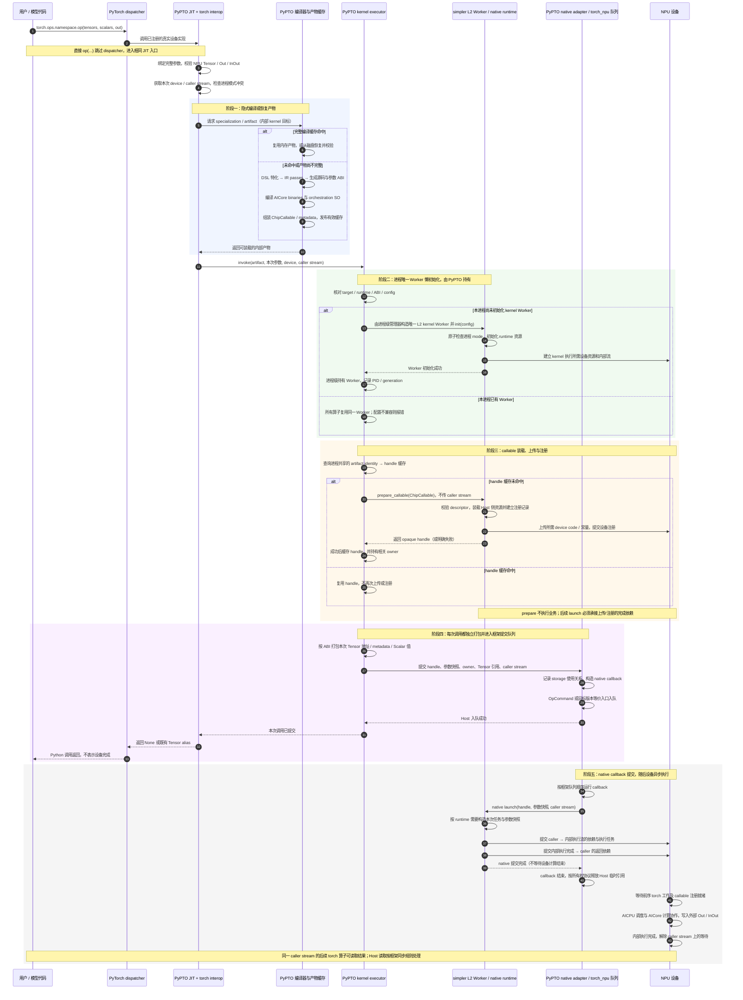
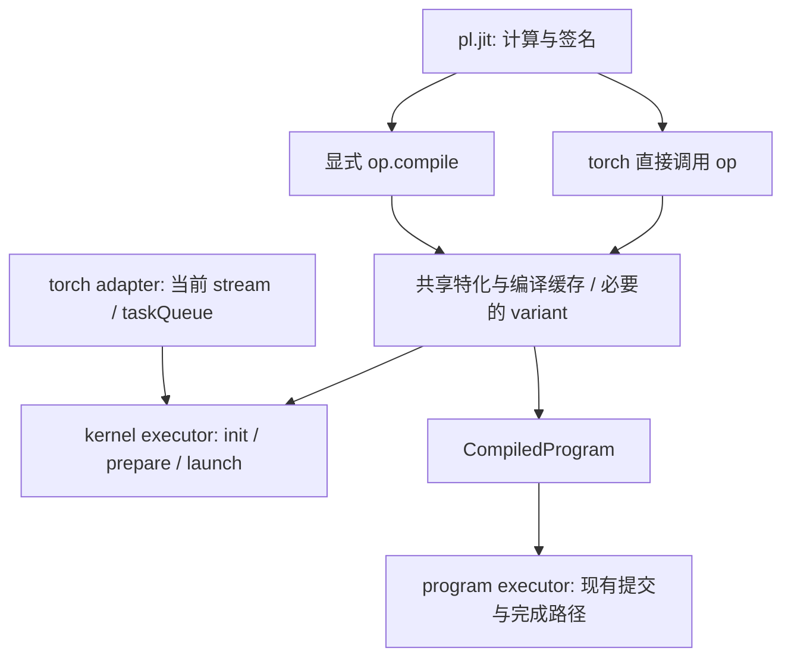

# PyPTO 正式 program / kernel 调用接口方案

[总体方案与执行过程](kernel-mode-plan.md) · [运行时与 simpler 接口](kernel-mode-runtime-design.md) · [PR 依赖与实施计划](kernel-mode-pr-plan.md)

日期：2026-09-14。版本：第五版，按依赖组织并行 PR，并区分 main 与 simpler 开发分支的落点。状态：设计讨论稿，未实施功能；本轮不考虑 simpler pipeline。

本方案保留普通 `@pl.jit`，由调用入口在内部确定 program/kernel：torch 直接调用 JIT 算子走 kernel；program 显式编译取得对象后调用，或将产物提交给 program runner/Worker。普通 Scalar 是每次调用传入的数据；业务输入、Out、InOut 均来自调用方。torch 直接调用内部完成编译、初始化、加载和 prepare；program 显式编译后也可由可调用对象管理运行所需状态。普通调用不新增 context、handle、prepare、close 或执行 workspace 管理要求，现有高级 Worker 接口保留。

kernel 与 program 共用参数和编译产物契约，但保留各自的提交路径。正式支持目标覆盖 A2/A3、A5 与 HBG、TRB 的组合，以及 eager、ACLGraph；内部可以逐步实现，不能把某个 demo 或子集标为完整交付。

## 1. 输入依据与版本差异

| 资料 | 阅读与核对情况 |
| ---- | -------------- |
| [正式调用接口范围清单，固定版本](https://github.com/nalinaly/pypto/blob/4b917bca487567f4f475c6ddc1aa95249188b4d3/tests/pypto_formal_interface_change_scope.md) | 已全文阅读；用作正式接口设计输入；其中 JIT 显式 mode 已按用户反馈调整；simpler pipeline 按最新要求移出本轮范围 |
| vllm-call-flow.md（输入附件，未随本分支发布） | 已全文阅读；继续采用其职责划分、队列顺序和异步所有权分析；与新范围清单冲突的限制已改写 |
| [飞书纪要](https://hw-native-sys.feishu.cn/docx/Av8BdY7m3oVKUNxO5V9c7U3hnnH?dcuId=7612956330277473498) | 仍无法读取；不声称本稿已经逐条核对纪要原文 |
| 设计时核对的 PyPTO 基线 | `feat/kernel-mode-runtime-pin`，`04b607bec6a566fe4cafa7b65609a8dc9b4af687` |
| 设计时核对的 simpler gitlink | `748c39fbe7825e8411f44e91b754a3b2449f633c`；核对到的 onboard kernel 入口仍为 stub |
| 参考 fork | `nalinaly/pypto` 的 `4b917bca487567f4f475c6ddc1aa95249188b4d3`；另核对了该版本的 JIT/demo 代码 |

新文档是尚未实施的设计清单，不能据此判断依赖已经支持所有能力。它描述的 `_l1_allocate_outputs`、`execution="l1"` 等原型代码存在于参考 fork；当前工作区未发现对应 L1 文件。实现时按两个版本分别处理，不能直接把 fork 的行号当作当前分支的落点，也不能整体覆盖当前分支较新的持久缓存逻辑。

本文件是用于分享和讨论的设计稿；下列源码引用固定到设计时核对的版本，不表示本分享分支已实现相关功能。

### 1.1 对第一版的明确修正

| 第一版选择 | 本版结论 |
| ---------- | -------- |
| 模式选择 | 第二版曾采用 JIT 显式 mode；第四版按用户澄清固定为 torch 直调 kernel、显式编译对象调用 program，详见 2.3；不按失败情况切换 |
| 普通 Scalar 仍按值特化，`pl.RUNTIME` 才动态 | 假设 main 已完成普通 Scalar 默认运行时及显式常量分类；kernel 直接复用 |
| 普通调用必须传 raw stream | torch adapter 每次获取当前设备/stream；原生 ABI 每次传 stream，compiled 不固定首个 stream |
| capture 前强制 eager 预热，capture 内只准命中缓存 | 不预设禁止首次 capture；走内部 lazy 流程，实测并定位真实限制，不公开 prepare 仪式 |
| 第一阶段支持集收窄到一款硬件 + TMR | 可以按此顺序开发，但正式验收保留完整矩阵；HBG 和 A5 不是可选后续方向 |
| 同一设备禁止两种 mode 共存 | **同一进程**禁止 program/kernel runtime 共存；不同设备也不能绕过 |
| kernel 路径显式输出，program 调用完全不变 | 正式调用入口两种 mode 都要求外部输出；program 的底层 Worker/内存能力不作无关删除 |
| 外部 workspace 及图 owner 的显式收尾协议 | 不公开 per-op workspace/allocator/close；不新增追踪所有外部 graph 的管理系统 |
| 独立 `_torch_npu.py` 与若干平铺 runtime 模块 | torch 专属功能集中在 `python/pypto/torch/`；kernel 内部状态集中在 `runtime/kernel/` |
| 沿用旧编译器包装即可 | PyPTO 必须掌握算子编译与产物生命周期；simpler 提供 SDK/运行时服务 |
| 暂不规定注册容量 | simpler 目标规格为 8192 个驻留条目、2 GiB device code 上限、按需 2 MiB 粒度；不是执行 heap 容量 |

## 2. 正式接口与配置来源

### 2.1 用户持有算子或一个可调用编译对象

下面展示目标接口；torch 直接调用的 kernel 路径尚未在当前工作区实现。DSL 主体采用现有 tile_add 的组织方式，不包含独立 context 或手动注册。

```python
import pypto.language as pl

@pl.jit
def tile_add(a: pl.Tensor, b: pl.Tensor, c: pl.Out[pl.Tensor]):
    with pl.at(level=pl.Level.CORE_GROUP):
        ta = pl.load(a, [0, 0], [128, 128])
        tb = pl.load(b, [0, 0], [128, 128])
        pl.store(pl.add(ta, tb), [0, 0], c)

# torch / kernel：a_npu、b_npu、c_npu 已由框架分配。
tile_add(a_npu, b_npu, c_npu)  # 内部 lazy 编译，读取本次当前 stream

# program：在另一个进程中显式编译后调用。
compiled = tile_add.compile(a_host, b_host, c_host)  # 不 init runtime、不执行
compiled(a_host, b_host, c_host)  # program 执行
```

program runner/Worker 入口使用同样的正式绑定规则，但沿用 program 提交路径。允许在同一进程定义、分析和编译适用于两条路径的对象；只有进入真实 runtime 初始化时才认领进程 mode。

不增加 JIT 的 mode 参数。入口决定如何执行，JIT 声明描述计算；不再保留“JIT 直调 CPU Tensor 自动走 program”的第三版提案。不保留 `L1Context/L1Operator`、`execution="l1"` 作为第二套长期公共接口。

Out/InOut 必须完整传入，缺参在编译或执行副作用前报错。IR 里的 return 和 alias 信息继续保留：没有 return 的算子返回 `None`；若 IR 返回某个已有输出/输入的别名，可以返回同一外部对象。不能为了禁止输出分配，把所有 IR return 或别名都删除。

### 2.2 配置来源和冲突规则

| 信息 | 权威来源 | 调用时行为 |
| ---- | -------- | ---------- |
| 执行 mode | JIT 的 torch 直接调用入口固定 kernel；显式编译对象调用及 program runner/Worker 入口固定 program（2.3） | 先确定执行请求，再验证产物能力与进程 mode；不由缓存、capture 或初始化先后顺序决定 |
| runtime（HBG/TRB） | 统一规范化后的编译配置与产物 | 不能用另一 runtime 执行已有产物；名称归一化保持唯一来源 |
| 目标架构/ABI | 编译请求和产物 | 核对实际设备；不沿用默认 simulator 配置执行真实 NPU tensor |
| 当前设备/stream | 每次真实 torch 调用的 adapter | 编译对象不缓存 caller stream；init/prepare 不接收它 |
| Scalar 实际值、tensor 地址 | 本次参数 | ABI 编码后提交，不改变编译特化 |
| 显式常量、静态 shape/layout | 签名与编译请求 | 参与编译 key，按原有动态维表达排除动态部分 |

不复用现有 `runner.ExecutionMode` 表示 program/kernel，它当前用于设备执行/模拟执行。不新增 RunConfig mode 开关作为普通用户选路方式；已有配置用于目标/能力约束，不能覆盖入口语义。参考 fork 的 `_runtime_names.py` 在当前工作区不存在，需对接当前已有 RuntimeKind 的规范化机制，而不是制造并行的字符串常量表。

无需为普通 eager 调用先注册 torch custom op。`python/pypto/torch/registration.py` 服务 torch.compile、Fake/Meta 等高级集成；不把它做成普通直接调用的额外步骤。

### 2.3 两条入口自然决定模式

按用户澄清，program 需要显式编译取得对象，torch 可以直接调用。建议固定以下契约，不再根据 Tensor 在 CPU/NPU 上的位置选择模式：

| 调用入口 | 执行路径 | 编译与运行时机 |
| -------- | -------- | -------------- |
| `op(a, b, out)`，即 JIT 对象的 torch 直接调用 | kernel | 内部按需编译，adapter 读取当前设备/stream，然后 lazy init/prepare/launch |
| `compiled = op.compile(...)` | 仅编译 | 返回 program 可调用编译对象，不初始化 runtime、不执行业务 |
| `compiled(a, b, out)` | program | 使用已编译对象，内部对接现有 program 执行路径 |
| 将显式编译产物交给 program runner/Worker | program | 保留已有高级运行入口及其资源协议 |

program 显式编译也包括已有 IR 编译入口，不要求所有 program 都改写成 JIT 函数。恢复的 program 编译对象及多 orchestration 子对象保持相同的 program 调用语义。

CPU/NPU、Tensor 所有权、shape、dtype、stream 只用于校验既定入口的参数合法性。torch 直接调用收到 CPU Tensor 或 Worker 自有 DeviceTensor 时，报不受支持的参数并提示 program 的显式编译入口，不偷偷改变执行路径。纯 Scalar 直调也固定 kernel：若未来支持此类算子，其设备/stream 由 torch 当前执行上下文提供；缺少有效上下文则报错。多设备或混合 Tensor 仍需校验，不隐式搬运来满足入口要求。

**当前代码与目标契约须区分。** 当前 `JITFunction.__call__` 经 `_resolve_compiled` 后直接调用 `CompiledProgram.__call__`，两者最终都走 program。不能声称“当前 program 已经强制显式编译”。本轮设计将两条执行路径拆开，当前依赖 JIT 直接调用 program 的测试和示例需迁移到显式编译对象调用。

内部 before/after（伪代码，helper 名不是新增公开 API）：

```python
# Before：JIT 直接调用复用 program 对象的执行入口。
def jit_call(args):
    compiled = resolve_compilation(args)
    return compiled(*args)

# After：两个公开调用入口共享编译设施，分别进入明确的执行路径。
def jit_call(args):
    bound = bind_and_validate_torch_args(args)
    validate_process_mode("kernel")
    artifact = resolve_compilation(bound, execution_target="kernel")
    return kernel_executor.invoke(artifact, bound)

def jit_compile(signature_or_samples):
    # 编译 program 所需产物；不认领进程 mode，不执行算子。
    artifact = resolve_compilation(signature_or_samples, execution_target="program")
    return CompiledProgram(artifact)

def compiled_program_call(compiled, args):
    bound = bind_and_validate_program_args(args)
    validate_process_mode("program")
    return program_executor.invoke(compiled.artifact, bound)
```

init 前仍需 simpler 原子检查进程准入，前面的检查只用于提前失败。内部编译目标不作为 JIT 装饰器或普通调用的 mode 参数公开。两种入口使用同一份计算定义和特化设施；只有代码/ABI 确实不同的部分才区分 binary variant。JIT kernel 执行不能重新调用 program 对象的 `__call__`，也不以 Tensor 类型修改同一个 compiled 对象的调用语义。

kernel 用户入口仅为直接调用，编译及缓存恢复由内部完成；本方案不提供 kernel 显式编译、预填缓存或可调用编译对象接口。`op.compile(...)(...)` 明确属于 program。已有 device-free 编译辅助接口按 program 兼容范围另行盘点，不作为 kernel 使用流程的一部分。

eager/capture 不改变入口语义。编译 program 对象后仍可在该进程只执行 kernel，因为编译不初始化 program runtime；若已执行 program，再调用 torch kernel，则触发既定的进程模式冲突。这里无需全局 mode 配置，也没有“无 Tensor 则默认 program”的选择规则。

### 2.4 从 torch 算子调用到设备完成的完整执行过程

下图描述**目标 kernel eager 路径**。起点使用用户关心的 `torch.ops.<namespace>.<op>(...)`；namespace/op 名为占位符，前提是该算子已完成可选的 torch 注册。直接调用 `@pl.jit` 对象 `op(...)` 时跳过 dispatcher，进入同一个 PyPTO JIT 入口。Fake/Meta 或 tracing 阶段不执行此图中的 Worker 初始化和设备提交。

图中的 kernel Worker 由 PyPTO 按进程唯一创建并持有；同一进程的不同算子和 specialization 共用它，用户不传 Worker，也不调用 `.compile()`、prepare 或上传接口。这里选择先编译/恢复并校验产物，再初始化 Worker：目标架构来自编译请求及实际设备，runtime/ABI/config 由产物确定，编译失败也不会留下新初始化的 Worker。已有 Worker 时只做兼容性检查；配置冲突报错，不按算子、设备或 runtime 另建 Worker。初始化不接收 caller stream；本次 stream 只用于实际提交。



为展示异步窗口，图采用 taskQueue 延迟消费的例子；callback 也可能在 Python 返回前已执行。关闭 taskQueue 时，框架可能在提交线程直接运行 callback。两种情况下都不能把 Host 返回或 callback 结束当成设备完成。callback 内不触发 Python 编译、prepare，也不依赖 GIL。

阶段五只描述 kernel 接入需要的执行和依赖关系，不设计 simpler pipeline。AICPU/AICore 的协作节点也不意味着所有 runtime 都在 AICPU 运行同一份 orchestration：HBG 的 Host 构图与 TRB 的设备侧任务组织按各自正式 ABI 执行。不能把整份 ChipCallable 视为一块必须原样上传的设备内存；Host SO 与 device binaries 各自在适合的执行位置装载。

#### 编译、上传与执行分别何时发生

| 动作 | 首次完全冷调用 | 已有 Worker、新 specialization | 编译和 handle 均命中的后续调用 |
| ---- | -------------- | ------------------------------ | ------------------------------ |
| 绑定参数、取得当前 device/stream | 每次执行 | 每次执行 | 每次执行 |
| PyPTO 编译/恢复产物 | 缓存 miss 才编译；持久缓存 hit 则恢复 | 同左 | 复用内部产物 |
| PyPTO 创建并初始化 Worker | 本进程首次 kernel 执行时创建一个 | 新算子/新 specialization 复用同一 Worker | 复用同一 Worker |
| simpler 装载/上传/注册 callable | handle miss 时 prepare | 新产物 handle miss 时 prepare | 跳过 |
| 打包本次地址和 Scalar、adapter 入队 | 每次执行 | 每次执行 | 每次执行 |
| native launch 与设备计算 | 每次业务调用一次 | 每次业务调用一次 | 每次业务调用一次 |

编译缓存和 handle 缓存是两层：磁盘 binary 命中不代表当前进程已上传；Worker 已初始化也不代表该 callable 已注册。普通 Scalar 变值不产生新 specialization，换 caller stream 不重新注册。不同算子并发首次调用也必须经过同一个进程级初始化锁，只创建一个 Worker；同一 callable 的 prepare 另按 identity 做 single-flight；简化图中未展开等待者分支。

prepare 返回 handle 后，上传/设备注册可能仍在执行。simpler 必须通过其正式的流顺序或完成协议保证 launch 不会使用尚未就绪的资源；PyPTO 不能凭 handle 已返回便声称上传已完成。任一阶段失败都停止后续业务提交，错误携带具体阶段；不发布失败的缓存项，不通过执行一次业务来探测是否准备完成。

#### capture / replay 在完整过程中的位置

capture 时仍从同一个 torch/JIT 入口进入，框架记录实际 launch 的流依赖和设备工作；冷状态下的编译/init/prepare 按第 6 章逐项验证，不新增手动准备步骤，也不保证尚未验证的平台组合一定成功。上图中的“设备计算完成”阶段在 capture 路径上对应被记录、后续 replay 执行的工作，不能把 capture 返回视为计算已完成。

replay 路径为“框架 replay → 已捕获图的设备依赖与工作 → 写入 Out/InOut → 图完成”，不会重新经过 Python JIT、编译器、Worker 初始化、prepare 或逐算子的 Host callback。图中的参数地址和按值 Scalar 按捕获快照解释，生命周期规则见第 5.3、6 章。

## 3. Scalar、常量与动态 shape

**设计前提：假设 main 已完成 [#2751](https://github.com/hw-native-sys/pypto/issues/2751)，普通 Scalar 默认具有运行时语义。** 这是本方案采用的基线假设，不是对 issue 已关闭或代码已合入的状态声明。kernel mode 直接使用该主线能力，不承担其参数绑定、特化、缓存语义改造及兼容迁移。

### 3.1 直接复用的主线契约

- 普通 Scalar 保留为 IR/ABI 参数，每次执行使用本次传入值；值变化不改变编译 identity。
- Scalar 类型、位置及显式常量的分类由主线编译器提供，跨 JIT 子函数保持一致。
- 显式常量的语法、`pl.RUNTIME` 的兼容行为及未标注数值的推导规则，均沿用主线最终接口，本方案不另作设计。
- 主线已经处理相应缓存版本及旧语义迁移；kernel 接入只补充自身需要的执行能力/ABI 信息，不重复实现 Scalar 缓存迁移。

kernel 层负责消费主线生成的参数签名，按 ABI 打包本次 Scalar 值，并在异步 callback 使用前保持参数快照有效。主线能力与新提交路径的衔接通过第 3.2 节的集成测试验证。

### 3.2 两条入口共用 Scalar 语义，分别验证

对于参数 `step: pl.Scalar[pl.INT32]`，kernel 通过直接调用验证运行时值，不提供显式编译步骤：

```python
# kernel / torch：hidden、out、cache 为外部 NPU Tensor。
# csa 是已定义的 DSL 算子，以下为 eager 调用。
csa(hidden, out, cache, 0)  # 首次调用内部 lazy 编译、prepare，并执行一次。
csa(hidden, out, cache, 1)  # 复用内部编译产物与注册记录，使用本次 step=1。
csa(hidden, out, cache, 2)  # 使用本次 step=2，不使用首次调用的 0。
```

在静态 Tensor metadata、显式常量和编译配置不变时，以上三次调用应命中相同的内部编译 identity。测试通过内部编译/prepare 计数验证复用，不要求用户获取 kernel 编译对象。每次调用分别与 reference 对比，并验证 InOut cache 只更新一次，防止 lazy prepare 偷跑业务。

program 的显式编译规则在**另一个测试进程**中验证，与上面的 kernel 调用分开：

```python
# program：使用 program 入口支持的外部参数。
program0 = csa.compile(hidden_host, out_host, cache_host, 0)
program1 = csa.compile(hidden_host, out_host, cache_host, 1)
# 两次样本编译不执行算子；相同静态信息应复用 program 编译 identity。
program0(hidden_host, out_host, cache_host, 2)  # 实际运行使用 step=2。
```

两条路径共用“普通 Scalar 按本次调用值执行”的语义，不承诺两种模式共享相同二进制 identity，也不混用执行对象。program 的样本编译与签名编译应得到一致的 Scalar 参数签名。

kernel 用户直接传入本次 Scalar 值，无需占位符或 `.compile()`。program 签名编译及显式常量使用 main 已确定的接口；相关语法、兼容性和旧例子迁移不属于本次 kernel 接入工作。

### 3.3 HBG 的每次任务构建与 ACLGraph 参数快照

若运行时 Scalar 控制 HBG Host 任务数量或分支，例如本次 `step` 决定构建几个 task，那么每次 eager 调用必须使用本次值生成/绑定执行内容。不能缓存首次 Host 构建结果后只替换 tensor 指针。这里可能需要每次构建执行计划，**不等于重新编译算子**。

动态 shape 沿用现有 DynDim/注解与约束。动态维不进入静态编译 key，但每次调用仍校验合法范围和布局。

ACLGraph replay 使用捕获时的节点和参数快照。用户改变地址、shape 或 Python scalar，不表示已捕获图自动更新；PyPTO 不自动重新 capture。HBG 的 per-call Host 构建如何进入图，以及哪些参数在 replay 中固定，需要在每个 runtime/平台上记录真实行为。

## 4. 编译产物与已加载状态

### 4.1 共享编译设施，分离执行入口



torch 用户只持有 JIT 算子，内部 kernel executor 管理对应产物和加载记录；program 用户持有显式编译得到的 CompiledProgram，或沿用高级 Worker 提交。kernel 的加载记录归进程级管理器所有并引用唯一 Worker，不能由每个算子创建自己的 Worker；program 记录沿用现有所有权。`del compiled` 不是立即卸载承诺。

编译不初始化设备、不认领 runtime mode、不执行业务。仍区分 generated 与 binary-ready，必要的完整编译可由后续调用内部完成，但不能把 generated-only 对象宣称为已经可设备执行。现有 device-free `warmup()` 若保留，只在 program 兼容接口中说明其编译/组装语义；kernel 的用户流程不展示此接口，内部 lazy 状态不要求用户手动推进。

### 4.2 缓存和 metadata

建议沿用现有 JIT/持久缓存与 `_binary_cache.py`，调整 key/schema，而非新增另一套存储系统。

| 层 | 必须区分 | 明确排除 |
| -- | -------- | -------- |
| 编译 identity | 目标、HBG/TRB、ABI、静态 Tensor metadata、Scalar 类型/位置、显式常量、编译选项及来源；若 mode 改变代码或 ABI，再区分对应 binary variant | 运行时 Scalar 值、Tensor 地址、caller stream |
| 已装配 callable | 编译 identity、选定 orchestration、完整 binary/signature descriptor | 日志用短 HID 不能单独作为注册 identity |
| kernel 设备加载记录 | 产物 identity、PID、进程唯一 Worker 的 generation；device/runtime/config 用于一致性校验，不用于创建多个 Worker | 不落盘，不跨 fork/进程/context 重用 native handle |

拟产物 metadata 核心字段：

```json
{
  "schema": "<new version>",
  "supported_execution_modes": ["kernel"],
  "runtime": "host_build_graph",
  "platform": "a5",
  "abi_version": "<agreed version>",
  "params": [
    {"name": "out", "kind": "tensor", "direction": "out", "tensor_index": 0},
    {"name": "step", "kind": "scalar", "dtype": "int32", "scalar_index": 0}
  ],
  "return_aliases": []
}
```

这是字段草案，不是完整 JSON schema；shape/layout、其余参数与 binary inventory 复用现有描述。Tensor 和 Scalar 分池且各自保持签名顺序，不能把混合 Python 参数列表整体复制成 ABI。

[compiled metadata schema](https://github.com/hw-native-sys/pypto/blob/04b607bec6a566fe4cafa7b65609a8dc9b4af687/python/pypto/ir/compiled_program.py#L80)、持久 artifact identity、binary context 需一起考虑版本变化。能力字段描述经验证的产物兼容性，不是用户选择；示例只声明 kernel，不能未经 ABI 验证便声明双模式通用。旧产物通过明确的 schema 升级器恢复已知能力，或要求重编译，不能直接推定支持 kernel。`execute_artifact`、`from_dir`、多 orchestration 子对象都必须保留产物能力及必要的 binary variant 信息。共享 metadata 变更联动分布式对象格式，但不新增分布式 kernel mode。

### 4.3 编译责任不能只停留在命名上

当前 [KernelCompiler](https://github.com/hw-native-sys/pypto/blob/04b607bec6a566fe4cafa7b65609a8dc9b4af687/python/pypto/runtime/kernel_compiler.py#L11) 是 `simpler_setup.KernelCompiler` 子类，项目根、工具选择和 orchestration 编译等行为仍继承自 simpler。新边界需要 PyPTO 掌握输出目录、源码生命周期、编译动作和缓存发布；simpler SDK 提供头文件、目标编译参数与 runtime 信息。

建议先将 SDK 信息查询与算子 build orchestration 分开，再收回依赖继承的生命周期控制。允许复用纯工具功能，不要求复制整套工具链，不先做无关目录搬迁。AICore binary 与 orchestration SO 均由 PyPTO 生成和缓存；simpler 把它们上传/装载到设备，不改变编译所有权。
