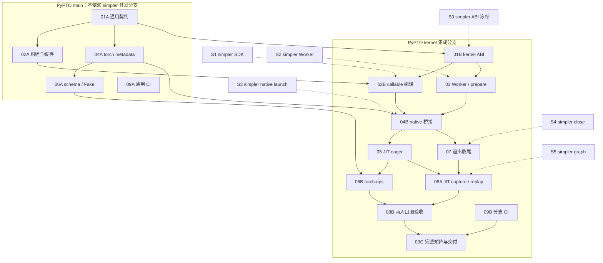

# PyPTO kernel mode：PR 依赖与实施计划

[总体方案与执行过程](kernel-mode-plan.md) · [运行时与 simpler 接口](kernel-mode-runtime-design.md) · [PR 依赖与实施计划](kernel-mode-pr-plan.md)

本文件承接第五版设计稿；子 PR 尚未创建，main 的 Scalar 修复按方案假设处理。

## 9. 文件改动与实施顺序

### 9.1 以当前工作区为基线的主要落点

| 文件/目录 | 具体改动 |
| --------- | -------- |
| [jit/decorator.py](https://github.com/hw-native-sys/pypto/blob/04b607bec6a566fe4cafa7b65609a8dc9b4af687/python/pypto/jit/decorator.py#L1922) | JIT 声明保持无 mode；JIT 直调固定进入 kernel；显式 compile 构建 program 对象；编译基础设施共享；直接/编译/compiled 同一参数契约；稳定签名预解析；完整输出绑定 |
| [jit/cache.py](https://github.com/hw-native-sys/pypto/blob/04b607bec6a566fe4cafa7b65609a8dc9b4af687/python/pypto/jit/cache.py#L60)、[specializer.py](https://github.com/hw-native-sys/pypto/blob/04b607bec6a566fe4cafa7b65609a8dc9b4af687/python/pypto/jit/specializer.py#L122)、[typing/scalar.py](https://github.com/hw-native-sys/pypto/blob/04b607bec6a566fe4cafa7b65609a8dc9b4af687/python/pypto/language/typing/scalar.py#L77) | 作为已具备的主线依赖直接复用；不在 kernel 接入中修改 Scalar 语义、常量语法或兼容规则 |
| [ir/compile.py](https://github.com/hw-native-sys/pypto/blob/04b607bec6a566fe4cafa7b65609a8dc9b4af687/python/pypto/ir/compile.py#L255)、[compiled_program.py](https://github.com/hw-native-sys/pypto/blob/04b607bec6a566fe4cafa7b65609a8dc9b4af687/python/pypto/ir/compiled_program.py#L634) | 产物能力/runtime/ABI metadata；输出不自动分配；CompiledProgram.**call** 保持 program 语义，kernel executor 独立接框架适配；装配和加载状态分离 |
| [backend/pto_backend.py](https://github.com/hw-native-sys/pypto/blob/04b607bec6a566fe4cafa7b65609a8dc9b4af687/python/pypto/backend/pto_backend.py#L543) | wrapper 和参数配置同步 Tensor/Scalar 顺序、类型、方向、alias、动态维及目标/runtime |
| [kernel_compiler.py](https://github.com/hw-native-sys/pypto/blob/04b607bec6a566fe4cafa7b65609a8dc9b4af687/python/pypto/runtime/kernel_compiler.py#L11)、[device_runner.py](https://github.com/hw-native-sys/pypto/blob/04b607bec6a566fe4cafa7b65609a8dc9b4af687/python/pypto/runtime/device_runner.py#L452) | PyPTO 主导编译、组装；拆清 SDK 查询与构建生命周期；保留 program 专用提交 |
| [execute_artifact.py](https://github.com/hw-native-sys/pypto/blob/04b607bec6a566fe4cafa7b65609a8dc9b4af687/python/pypto/runtime/execute_artifact.py)、`_binary_cache.py`、`_artifact_runtime.py`、`jit/_artifact_manifest.py` | 产物能力/variant/schema 贯穿重建和持久缓存，不存 native handle；沿用现有系统，不另造产物审计流程 |
| `runtime/_execution_mode.py`、`runtime/kernel/`（拟新增） | 进程准入、唯一 kernel Worker 管理及共享加载记录、正式 ABI 适配 |
| `python/pypto/torch/`（拟新增）、[task_interface.py](https://github.com/hw-native-sys/pypto/blob/04b607bec6a566fe4cafa7b65609a8dc9b4af687/python/pypto/runtime/task_interface.py)、[tensor_arg.py](https://github.com/hw-native-sys/pypto/blob/04b607bec6a566fe4cafa7b65609a8dc9b4af687/python/pypto/runtime/tensor_arg.py) | 新增 **init**/interop/launch/registration 四个模块及可选 native adapter；框架适配与 runtime Worker 状态分离；保留 program address-free、Worker-aware 路径 |
| [runtime/worker.py](https://github.com/hw-native-sys/pypto/blob/04b607bec6a566fe4cafa7b65609a8dc9b4af687/python/pypto/runtime/worker.py)、[runner.py](https://github.com/hw-native-sys/pypto/blob/04b607bec6a566fe4cafa7b65609a8dc9b4af687/python/pypto/runtime/runner.py#L224)、[runtime_base.py](https://github.com/hw-native-sys/pypto/blob/04b607bec6a566fe4cafa7b65609a8dc9b4af687/python/pypto/runtime/runtime_base.py) | 所有初始化入口的 mode 防护、正式参数契约及现有 program 路径兼容；不删除无关管理能力 |
| [python/bindings/CMakeLists.txt](https://github.com/hw-native-sys/pypto/blob/04b607bec6a566fe4cafa7b65609a8dc9b4af687/python/bindings/CMakeLists.txt)、[pyproject.toml](https://github.com/hw-native-sys/pypto/blob/04b607bec6a566fe4cafa7b65609a8dc9b4af687/pyproject.toml) | 独立 torch_npu adapter target 与安装；无 torch_npu 的编译/IR 环境继续可用 |
| `python/pypto/__init__.py`、`runtime/__init__.py`、`jit/__init__.py`、`language/typing/__init__.py` 等 | 只导出最终公共符号，lazy import；同步 typing，不公开内部 context/prepare/close |

若正式 wrapper 或 C++ ABI 改变，再精确联动 `src/codegen/orchestration/`、对应 include、nanobind codegen binding 和 `pypto_core/codegen.pyi`。共享 metadata/初始化改动需要 distributed 编译对象/runner 回归，但不增加分布式 kernel 功能。

Tensor/Scalar IR 定义、数学算子、tile/SPMD、依赖和 memory planning pass 不属于默认重写范围。

### 9.2 fork 原型如何复用

参考 fork 的 `execution="l1"`、`_l1_allocate_outputs`、`l1.py`、`l1_jit.py` 和 `torch_npu_l1_adapter.cpp` 属于原型，不是当前工作区已经存在的正式层。适合提取的是 taskQueue/recordStream、参数保活和有效回归经验，不复制手动 context、输出自动分配与旧 queue-call 契约。

如果将原型提交导入本分支，应先映射到正式目录/ABI；正式路径完成后删除 demo 公共导出和重复实现，不维持永久兼容层。当前分支没有的 demo 文件无需为了“退场”先引入一遍。历史诊断记录保留，仅标注原型身份；不批量改写历史，也不引入参考 fork 较旧的 JIT 实现覆盖现有持久缓存。

### 9.3 PR 依赖图、并行开发与目标分支

PR 编号表示工作包，不表示串行次序；尚未创建这些实现 PR。将混合职责的工作包拆为 A/B/C 子 PR，每个子 PR 单独评审、验证和合入。下表的依赖是交付依赖：接口明确后可以提前并行写代码，但必须有依赖的实现及验证结果才能合入并声称可用。

**基线假设**：`main` 已修复 #2751；复用普通 Scalar 的运行时语义，不再安排修复 PR。simpler pipeline、vLLM/recipes 接线不在本轮范围。以下是建议落点，不表示这些功能已存在于 `main`。

**两条开发线**：M 类从 PyPTO `main` 开分支并提 PR 到 `main`，不升级到 simpler 开发分支、不切换现有 program 用户行为；K 类提 PR 到 PyPTO `feat/kernel-mode-integration-test`，消费 simpler `hw-native-sys:feat/kernel-mode-integration-test` 的已验证 commit。分支名使用 `feat/kernel-mode-*` 等非 `codex/` 前缀。

**simpler 交付门槛**：S0 = 冻结 Python/native ABI、descriptor、配置及所有权；S1 = SDK/工具链可编译真实 callable；S2 = 非 stub Worker init/prepare、进程互斥与资源注册；S3 = native launch、stream 依赖及异步错误；S4 = owner 线程 close、排空与释放契约；S5 = capture/replay、共享资源与图生命周期。它们是验收门槛，不要求 simpler 按 S1→S5 串行开发。只有 S0 不等于已有可运行实现。

| 子 PR / 交付范围 | PyPTO 目标 | PyPTO 前置依赖 | simpler 依赖 / 合入边界 |
| ---------------- | ---------- | -------------- | ----------------------- |
| 01A：通用能力/schema、参数绑定、缓存兼容 | M / main | 已修复 Scalar 的基线 | 不依赖开发分支；使用中立字段，不声明旧产物兼容 kernel |
| 01B：kernel ABI 映射及 descriptor 契约 | K / 集成分支 | 01A | S0；可先提交契约与校验，不宣称 Worker 可运行 |
| 02A：构建职责拆分、通用缓存恢复 | M / main | 01A | 只用 main 已有 SDK；当前 program 产物与行为回归通过 |
| 02B：kernel wrapper、编译和 ChipCallable 组装 | K / 集成分支 | 01B、02A | S1；真实工具链编译与 descriptor 校验，不需 Worker |
| 03：进程唯一 Worker、去重 prepare、模式防护 | K / 集成分支 | 01B | S2；可用独立 callable fixture 验证，不等待 02B |
| 04A：torch metadata 校验与每次调用 frame | M / main | 01A | 不依赖开发分支；内部纯适配、可选 import，不引入 native handle/launch |
| 04B：native 队列桥接、参数/owner 保活 | K / 集成分支 | 04A、03；02B 提供真实 DSL 验收产物 | S3；编码可先行，合入前必须完成真实提交验证 |
| 05：JIT eager 接线与 program 调用迁移 | K / 集成分支 | 04B（含 02B、03） | 继承 S1～S3；不再等待 torch.ops 注册 |
| 06A：schema、alias、Fake/Meta 内部辅助 | M / main | 04A | 不依赖开发分支；用测试注册验证，不导出不可执行的正式 kernel op |
| 06B：正式 torch.ops 注册并接入 kernel | K / 集成分支 | 06A、05 | 继承 S1～S3；实际设备实现复用 JIT 路径 |
| 07：退出通知、排空、唯一 Worker close | K / 集成分支 | 04B（含 03） | S4 + 框架退出契约；内部调用可验收，不等待 05/06B |
| 08A：直接 JIT capture/replay 与安全退出 | K / 集成分支 | 05、07 | S5；不等待 torch.ops；真实图退出在此完成 |
| 08B：torch.ops 图集成与两入口一致性 | K / 集成分支 | 08A、06B | 同一组 S5 能力；补注册入口图验收 |
| 09A：通用静态检查、UT/可选构建设施 | M / main | 无功能前置 | 不依赖开发分支；仅补现有 CI 缺口，不重复已有检查 |
| 09B：集成分支过滤、设备任务与结果汇总接线 | K / 集成分支 | 无功能前置；可复用 09A | CI 接线不依赖 simpler 实现；设备 job 按对应 S 门槛启用 |
| 09C：完整矩阵、正式示例与交付汇总 | K / 集成分支 | 08B、09B（其余功能依赖已传递满足） | S1～S5 + 全平台实测；不能以跳过必验项宣布交付 |



实线表示子 PR 的交付依赖，虚线表示 simpler 的外部交付门槛；M/K 分组标记 PR 目标分支。09A 与 09B 可以并行；若 09B 复用 09A 新增设施，则把该次具体 PR 的依赖补到描述中。

**可并行安排**：① 01A、09A、09B 与 simpler S0 对齐可立即启动；② 01A 后，02A、04A 与 01B 并行；04A 后即可开始 06A；③ 01B 后，03 可与 02B 并行，分别等待 S2/S1；04B 的框架侧编码可按冻结 ABI 同期准备，真实验收等 02B/03/S3；④ 04B 后，05 与 07 并行；⑤ 05 后，06B 与满足 07/S5 的 08A 并行；⑥ 08B 汇合两条路径，09C 做最终验收。CI 与各 PR 的测试随功能递增，不集中到末尾。

**main 合入条件**：M 类子 PR 必须在 main 原有 runtime gitlink 上独立验证，保持 program 调用/输出行为和无 torch_npu 环境可用；不能靠 mock 掩盖新增的 simpler 依赖。若 02A 的抽取实际需要开发版 SDK，将对应接线留在 02B；若 04A/06A 的字段依赖 native descriptor，将该部分移到 K 类。是否先落 main 取决于这个边界，而不是文件位于 Python 还是 C++。

**分支同步与验收**：M 类合入 main 后，统一同步到 PyPTO 集成分支，K 类再消费，不重复提交同一改动。每个 PR 合入前所需的前置 PR 应已在其目标分支；并行草稿可暂时叠分支，但不得把未合入代码的检查结果当成最终基线结果。K 类 runtime gitlink 固定到满足所需 S 门槛的确切 SHA，并记录能力差异；不要求所有 PR 各自升级，也不把移动分支名当版本。普通 eager、close、图能力分别验收；直到 09C 完成才声明正式完整支持。依赖 simpler 开发分支的 K 类不能直接合入 main；待 simpler 对应能力进入主线、PyPTO 使用稳定 pin 并完成回归后，再安排上游合并。

### 9.4 每个 PR 的具体内容

#### PR-01：定义产物能力、参数绑定与持久格式

**拆分与落点**：01A → main：通用 schema/绑定/持久缓存兼容；01B → 集成分支：kernel ABI 映射。下面涉及具体 kernel ABI 的字段与能力校验归 01B，不使 01A 依赖开发版 runtime。

**结果**：明确“编译产物能在哪种执行路径使用”以及参数 ABI；保持主线 Scalar 语义和现有公开执行路径。

具体改动：

1. 为内部编译请求和产物 metadata 增加第 4.2 节的执行能力/ABI 信息；只有经过 ABI 核对才允许共享 program/kernel binary，不能对旧产物默认声明支持 kernel。
2. 提取共享的完整参数校验能力，能够要求全部 Out/InOut，并保留 IR return/alias。这里提供内部校验设施；正式入口的输出行为切换统一留到 PR-05，避免只改一半调用链。
3. 联动 `from_dir`、多 orchestration 子对象、generated/binary-ready manifest 的保存与恢复。旧 schema 使用明确迁移器或报重编译；错误不得导致自动执行另一 mode。
4. 内存及持久 identity 增加确实影响代码/ABI 的字段；不重写主线 Scalar 分类，不把地址、stream 或 runtime Scalar 值放回编译 key。

主要文件：[ir/compiled_program.py](https://github.com/hw-native-sys/pypto/blob/04b607bec6a566fe4cafa7b65609a8dc9b4af687/python/pypto/ir/compiled_program.py#L634)、[ir/compile.py](https://github.com/hw-native-sys/pypto/blob/04b607bec6a566fe4cafa7b65609a8dc9b4af687/python/pypto/ir/compile.py#L255)、`jit/_artifact_manifest.py`、`jit/_persistent.py`、`runtime/_artifact_runtime.py`、`runtime/execute_artifact.py`；确有编译 identity 差异时调整 `jit/cache.py`。复用现有模块，不为一份 schema 创建第二套缓存系统。

前后示意：

```python
# Before: recovery cannot establish kernel compatibility from an explicit contract.
artifact = restore_existing_metadata(path)

# After: illustrative internal helper names.
artifact = restore_versioned_metadata(path)
artifact.require_compatible_execution("kernel", runtime_abi)
bound = bind_complete_args(artifact.signature, values)  # Out/InOut included
```

**验收**：`tests/ut/ir/test_compiled_program.py`、`test_compile_pipeline.py`、`tests/ut/jit/test_artifact_cache.py`、`tests/ut/runtime/test_execute_artifact.py` 验证新格式往返、旧格式处理、能力冲突、alias 和缺参诊断；program 和 distributed 恢复回归通过。编译和恢复不 init Worker，不执行业务。项目文档加入产物字段及版本规则。

#### PR-02：PyPTO 掌握编译、组装与缓存恢复

**拆分与落点**：02A → main：基于现有 SDK 的构建职责和通用缓存重构；02B → 集成分支：kernel wrapper、SDK 接线及 ChipCallable 组装。下面真实 kernel 编译验收属于 02B；02A 用现有 program 产物验证。

**结果**：JIT 内部取得完整 ChipCallable，不依赖设备 Worker 完成算子编译。

具体改动：

1. 梳理 `KernelCompiler` 当前从 `simpler_setup.KernelCompiler` 继承的工具选择、源码管理、编译与链接行为；将 SDK 信息消费与 PyPTO build 生命周期分开，逐项列出替换关系。
2. 接通 kernel 内部编译请求，复用 specialization、IR passes 和代码生成，产出 orchestration SO、AICore binaries 与正确 descriptor。按 runtime 确认 Host/device 资源位置。
3. 复用现有生成态/完整二进制态缓存，磁盘完整命中不再次调用编译器；生成态命中只补缺失二进制。失败不发布完整产物，保留并发构建与只读恢复契约。
4. 仅当正式 ABI 要求不同 wrapper 时修改 codegen；列出参数池、标量类型/位置及返回别名的差异，不默认重写 pass 或 IR。

主要文件：[runtime/kernel_compiler.py](https://github.com/hw-native-sys/pypto/blob/04b607bec6a566fe4cafa7b65609a8dc9b4af687/python/pypto/runtime/kernel_compiler.py#L11)、[runtime/device_runner.py](https://github.com/hw-native-sys/pypto/blob/04b607bec6a566fe4cafa7b65609a8dc9b4af687/python/pypto/runtime/device_runner.py#L452)、`runtime/_binary_cache.py`、`runtime/_artifact_runtime.py`、`jit/_toolchain.py`、[backend/pto_backend.py](https://github.com/hw-native-sys/pypto/blob/04b607bec6a566fe4cafa7b65609a8dc9b4af687/python/pypto/backend/pto_backend.py#L543)。C++ codegen 确有接口变化时才同步 include、binding 与 stub。

```python
# Target internal behavior; no public kernel compile() entry is added.
artifact = resolve_kernel_artifact(request)
chip_callable = assemble_chip_callable(artifact)
assert process_worker_was_not_initialized()
```

**验收**：沿用 `tests/ut/runtime/test_prebuilt_artifact.py`、`test_binary_cache_context.py`、`tests/ut/jit/test_artifact_cache.py` 与 codegen signature 测试；覆盖完整命中、部分命中、缺失/损坏产物和并发发布。至少一份真实 DSL 产物完成目标工具链编译及 descriptor 校验。此 PR 证明可编译，不宣称设备执行或 capture 已通过。

#### PR-03：进程唯一 Worker、模式防护与 callable 注册

**依赖与落点**：集成分支；依赖 01B、simpler S2，与 02B 并行。状态机可先用替身开发，合入前补真实 Worker/prepare 验证。

**结果**：不同算子共享一个 PyPTO 持有的 kernel Worker，按产物去重上传注册。

具体改动：

1. 新增进程级管理器，区分未初始化、初始化中、可用、失败与关闭状态；所有算子共用初始化锁和 Worker 强引用，校验 PID、device、runtime/config。
2. 对接第 8.1 节正式 `init/prepare/close` 和能力查询；需要时升级 runtime gitlink。已有 Worker 配置不兼容则报错，不按设备/runtime/算子新建 Worker。
3. 建立进程共享的完整 callable identity → handle 表；同 identity 并发 prepare 只执行一次，失败不发布，handle 不落盘。每个注册项持有必需 owner。
4. 实现 program/kernel 初始化互斥的 PyPTO 提前检查，并验证 simpler 的最终防护；覆盖直接 program runner/Worker 等初始化入口。
5. 建立内部终止和清理原语，遵守 init-owner 线程约束；此时不注册一个未经验证的裸 `atexit` close。框架退出串接留给 PR-07。

拟新增 `runtime/_execution_mode.py`、`runtime/kernel/__init__.py`、`runtime/kernel/context.py`、`runtime/kernel/callable.py`、`runtime/kernel/abi.py`；调整 `runtime/worker.py`、`runtime/runtime_base.py` 的初始化边界。注册表由管理器拥有，`callable.py` 提供操作，不形成两份权威状态。

```python
state = get_process_kernel_state()
worker = state.ensure_worker(config, device)
handle_a = state.ensure_callable(worker, artifact_a)
handle_b = state.ensure_callable(worker, artifact_b)
# Both handles belong to the same worker; artifact_a repeated reuses handle_a.
```

**验收**：新增 `tests/ut/runtime/test_kernel_context.py`、`test_kernel_callable.py`、`test_execution_mode.py`，验证跨算子并发 init 计数为 1、同产物 prepare 计数为 1、不同产物各注册一次、失败传播、线程/PID/配置冲突和内部终止状态。契约替身测试与 simpler 实际 ABI smoke 分开记录，不能因 mock 通过就忽略 runtime stub。

#### PR-04：torch 参数适配与 native 队列桥接

**拆分与落点**：04A → main：metadata/frame、输入校验、可选 import；04B → 集成分支：native ABI、队列、allocator/owner 保活和真实提交。04B 编码可先行，完成下述 DSL 执行验收才合入。

**结果**：给定已准备好的真实 callable，PyPTO 能经 torch 有序提交路径执行并正确保持资源有效。

具体改动：

1. 新增 `torch/__init__.py`、`torch/interop.py`、`torch/launch.py`；校验 NPU Tensor、完整输出、alias/stride/format，逐次取得当前 device/stream，打包主线签名中的 Scalar 值。
2. 新增独立可选 native adapter；拟放在 `python/bindings/torch/torch_npu_adapter.cpp`，具体位置遵循实施时 CMake 组织。Python 入口传 handle、owner、参数快照及 Tensor 引用。
3. callback 使用 simpler 正式 native launcher，不执行 Python/JIT/prepare；OpCommand 或目标版本等价接口保证框架提交顺序。taskQueue 开关均使用相同业务语义。
4. Tensor 和参数保活覆盖 Host 延迟窗口；正确记录 allocator 的 stream 使用，处理别名 storage 和部分 enqueue 失败。缺少参数、错误布局不能通过隐式复制或输出分配补齐。
5. 延迟加载 native 扩展，普通 import/IR 编译不要求 torch_npu；缺少扩展时真实 kernel 执行给出明确错误。

主要文件：上述三个新 Python 文件、拟新增 native 源文件、[python/bindings/CMakeLists.txt](https://github.com/hw-native-sys/pypto/blob/04b607bec6a566fe4cafa7b65609a8dc9b4af687/python/bindings/CMakeLists.txt)、[pyproject.toml](https://github.com/hw-native-sys/pypto/blob/04b607bec6a566fe4cafa7b65609a8dc9b4af687/pyproject.toml)、`runtime/kernel/abi.py`。构建参数和目标版本的兼容范围随 PR 文档记录。

```python
frame = torch_interop.describe_call(bound)
# launch.py delegates ownership and enqueue to the native adapter.
torch_launch.enqueue(loaded_handle, bound, frame)
# Submission success is not device completion.
```

**验收**：新增 `tests/ut/torch/test_interop.py`、`test_launch.py`；在 `tests/st/runtime/kernel/` 增加 A → PyPTO → B 顺序、非默认 stream、taskQueue 开关、延迟 callback 快照、GC 后 allocator 压力与错误注入。至少使用 PR-02 生成的一份真实 DSL callable 做桥接验证，手写 callable 只作 ABI 单测。公共 JIT 路径暂不切换，内部桥接由测试驱动。

#### PR-05：切换 JIT 直接调用，形成真实 eager 闭环

**依赖与落点**：集成分支；依赖 04B 及其编译/Worker 前置。与 07 并行；本 PR 完成用户入口与输出行为的统一迁移，不等待 06B。

**结果**：用户通过普通 `op(...)` 调用 kernel；显式编译对象继续走 program，整个 kernel 过程无需公开 mode、compile、Worker 或 prepare。

具体改动：

1. 修改 `JITFunction.__call__`，复用隐式编译和缓存，取得内部产物后进入 kernel executor；不再调用 `CompiledProgram.__call__` 执行 kernel。
2. 保持 `JITFunction.compile`/IR compile 返回 program 编译对象；`CompiledProgram.__call__`、恢复对象及子 callable 保持 program 语义。
3. 在两种正式入口统一要求外部 Out/InOut，停止自动分配缺失业务输出，保留返回别名。明确缺参和不支持 CPU/DeviceTensor 的 kernel 诊断，不按参数位置静默切换 mode。
4. 将依赖旧 JIT 直调 program 的 UT、ST、examples 改为显式编译后调用；按用例意图迁移，不能把所有 CPU 测试机械改成 NPU 测试。新的 kernel 测试使用真实 NPU Tensor。
5. 接通进程共享 Worker、产物及 handle 缓存计数，验证首次调用只执行业务一次；跨算子调用和新 specialization 只增加必要注册。
6. 第一批 eager 支持组合明确列入文档；未验证的目标仍保留在第 10 章正式矩阵中，不将此 PR 作为全平台或 capture 交付。

主要文件：[jit/decorator.py](https://github.com/hw-native-sys/pypto/blob/04b607bec6a566fe4cafa7b65609a8dc9b4af687/python/pypto/jit/decorator.py#L2618)、[ir/compiled_program.py](https://github.com/hw-native-sys/pypto/blob/04b607bec6a566fe4cafa7b65609a8dc9b4af687/python/pypto/ir/compiled_program.py#L634)、`runtime/kernel/callable.py`、`torch/interop.py`、`torch/launch.py`；`runner.py` 和 `device_runner.py` 仅保留必要的 program 路径接线。受影响测试/示例通过搜索直接调用及 return-style 用法形成明确迁移清单，随 PR 描述提交。

```python
# Before: direct calls eventually execute through CompiledProgram.
compiled, args, config = self._resolve_compiled(args, kwargs)
return compiled(*args, config=config)

# After: illustrative dispatch after the existing compilation/cache machinery.
artifact, bound, frame = resolve_kernel_call(args, kwargs)
return kernel_executor.invoke(artifact, bound, frame)

# Program users explicitly compile, then call the returned object.
program = op.compile(*samples)
program(*runtime_args)
```

**验收**：`tests/ut/jit/test_decorator.py`、`tests/ut/ir/test_compiled_program.py`、`tests/ut/runtime/test_chip_worker_explicit_dispatch.py` 等相关 program 回归；新增 `tests/st/runtime/kernel/test_jit_eager.py`、`test_inout_scalar.py`、`test_multi_callable.py`。至少完成 tile add 和一次真实 InOut 更新：多次 Scalar 变值使用本次值、compile/init/prepare 次数正确、多个算子共享唯一 Worker。程序模式与 kernel 模式在隔离进程执行。

#### PR-06：torch.ops 注册与 Fake/Meta 集成

**拆分与落点**：06A → main：schema/alias/Fake 辅助及测试内注册；06B → 集成分支：正式注册导出和设备实现。只有 06B 依赖 05；下面真实 torch.ops 与 torch.compile 的端到端验收归 06B。

**结果**：用户既可以直接 `op(...)`，也可以经已注册的 `torch.ops` 调用同一条 kernel 路径。

具体改动：

1. 新增 `torch/registration.py`，从已有参数签名提取 schema 所需信息，明确 Out/InOut mutation、返回类型及 alias 关系；拒绝当前集成无法正确表达的 schema。
2. 注册实际设备实现到 PR-05 的 JIT/kernel 入口，不维护第二份 Worker、编译缓存或执行器。
3. 添加 Fake/Meta 实现，按既定输出/alias 契约推导与校验 metadata；不创建 Worker、不 init/prepare/launch，不产生真实设备副作用。
4. 定义重复注册、名称冲突及模块重复 import 的行为；使用目标 PyTorch 支持的注册路径，不以 raw dispatcher 注册成功替代 torch.compile 行为验证。
5. 明确没有 backward 时的行为，不隐式承诺 autograd。注册辅助的具体公开函数名在本 PR 定稿并同步导出/文档，示例中的 namespace 仅为示意。

主要文件：拟新增 `python/pypto/torch/registration.py`，调整 `torch/__init__.py`，必要时复用 `interop.py` 的 metadata 校验；新增 `tests/ut/torch/test_registration.py` 和 `tests/st/runtime/kernel/test_torch_ops.py`。

```python
# After registration through the agreed helper:
torch.ops.pypto_example.tile_add(a, b, out)
# Calls the same kernel path as tile_add(a, b, out).
```

**验收**：真实 `torch.ops` 与普通 JIT 的结果、Worker identity 和 handle 复用一致；schema 正确标注写入与别名；Fake/Meta 执行的 init/prepare/launch 计数全为 0；重复注册/冲突明确；至少一个目标版本上的 torch.compile/Fake 路径检查通过。torch.compile tracing 与 ACLGraph capture 分别记录，不能混为同一能力。

#### PR-07：进程退出的安全收尾

**依赖与落点**：集成分支；依赖 04B/03、simpler S4 和框架退出契约，不依赖 05 或 06B。先验证内部提交的退出，真实 graph teardown 在 08A 补齐。

**结果**：PyPTO 的进程级管理器在框架依赖仍有效时关闭唯一 Worker，算子用户无需手动 close。

具体改动：

1. 在 PR-03 的管理器中接入幂等收尾状态，阻止新调用，并协调进行中的 init/prepare/提交；单个算子 GC 不触发收尾。
2. `torch/launch.py` 与框架的内部退出通知协调 Host callback 排空、设备完成及停止新 replay。选定的钩子及目标版本顺序需有证据，不能仅加 `atexit(worker.close)`。
3. 按 simpler 的 init-owner 线程规则调用 close；图资源不会再访问 callable 后才释放 Worker，成功后清空 handle 表。
4. 明确未初始化、部分初始化失败、重复通知、close 失败、框架已经拆除及异常终止的处理；不把“开始关闭”当作“安全释放完成”。
5. 不实现追踪所有外部 graph 的新管理系统。退出顺序无法保证时保留到进程终止，并记录限制；不能因此宣称正常显式 close 已验证。

主要文件：`runtime/kernel/context.py`、`runtime/kernel/callable.py`、`torch/launch.py`、native adapter 的 owner 保活部分。代码位置跟随已有模块，不增加用户生命周期 API。

```text
READY → STOPPING → 排空 Host callback / 在途设备工作
                 → 框架图资源停止使用 callable
                 → owner 线程 close → CLOSED
失败或顺序不确定：保留失败/退出状态与必要引用，不重新创建 Worker
```

**验收**：新增 `tests/ut/runtime/test_kernel_shutdown.py`，使用独立子进程验证多算子只 close 一次、未初始化零 close、线程约束、延迟 callback、重复退出通知及失败状态。设备集成验证 eager 工作排空和框架拆除顺序；graph teardown 协议可先以替身验证，PR-08 补真实 capture/replay 的退出测试。若目标框架暂无可靠钩子，需修复内部集成或将正常 close 明确记为未完成，不能通过要求用户手动关闭来验收。

#### PR-08：ACLGraph capture/replay 与图生命周期

**拆分与落点**：均在集成分支；08A 依赖 05、07、simpler S5，完成直接 JIT 图路径；08B 依赖 08A、06B，补 torch.ops 图路径。注册不阻塞 08A，完整两入口验收需要 08B。

**结果**：同一 kernel 调用入口可进入 capture，并由框架 replay 已捕获的设备工作；不增加显式准备步骤。

具体改动：

1. 在 torch adapter/受限操作的诊断边界接入 capture 状态信息，保持同一 device/stream 上下文；mode 不因 eager/capture 改变。
2. 逐项验证冷状态中的隐式编译、Worker init、资源装载、prepare 和 launch。发现受限操作时修复其内部路径或与 simpler 配套修复，不增加统一的“先 eager/prepare”规则。
3. 验证 caller 与内部流的进入/返回依赖、多个 callable 与不同 stream 的执行顺序；graph replay 不回 Python，不能依赖 Python 锁保证设备资源串行。
4. 明确 Tensor 地址与按值 Scalar 的捕获快照；不自动改变图参数或重新 capture。HBG Host 构图的真实可捕获行为需要单独验证。
5. 补齐 PR-07 的真实图生命周期测试：在途 replay 未完成时不释放、框架停止 replay 后正确关闭、依赖拆除顺序一致。
6. 失败保留阶段/API/资源状态，不退回 program，不隐式退出 capture；每个失败组合保留为验收缺口。

主要文件：`torch/interop.py`、`torch/launch.py`、native adapter、`runtime/kernel/context.py`、`runtime/kernel/callable.py`；只有对接协议变化时修改 `abi.py`/runtime gitlink。新增 `tests/st/runtime/kernel/test_capture.py`、`test_replay.py`、`test_graph_shutdown.py`。

```python
# Target behavior; graph setup and tensors belong to the caller.
with torch.npu.graph(graph):
    op(a, b, out)  # No user compile(), prepare(), or mode argument.
graph.replay()
```

**验收**：尚未编译/未初始化、内部 generated 缓存、binary-ready 未注册、已注册四种起始状态分别在隔离进程测试。至少覆盖直接 JIT 和 torch.ops 两种入口，多节点、多次 replay、不同参数快照、stream 顺序与图退出。冷路径失败保留实际证据且不标为通过；完整平台覆盖在 PR-09 汇总，但已发现的正确性问题必须在交付前解决。

#### PR-09：完整平台验收、分支 CI 和正式示例

**拆分与落点**：09A → main：通用检查设施；09B → 集成分支：目标分支过滤及设备任务接线，可立即开始；09C → 集成分支：等待 08B/09B，完成下面全部矩阵与正式示例验收。检查随各功能 PR 接入，不等 09C 才配置 CI。

**结果**：kernel mode 的正式支持范围可复核，后续合入目标分支的 PR 自动检查相关功能。

具体改动：

1. 将第 10 章 A2/A3、A5 × HBG/TRB × eager/capture/replay 参数化为统一用例矩阵。A2、A3 实机结果分别记录；每个进程只用一个固定 device/runtime 的 Worker。
2. 延续当前 `kernel-mode-ci.yml` 中的静态检查和 clang-tidy，逐步加入相关 UT、可选 native 扩展构建检查及定向设备任务；以 `feat/kernel-mode-integration-test` 为 PR 目标分支过滤条件。
3. 硬件 runner 接入前列出实际可用标签、依赖版本和每个矩阵单元的调度方式，不在文档里杜撰 runner 标签。未运行、缺少硬件、stub、测试失败与通过分别报告；最终汇总检查不因必验 job 被跳过而通过。
4. 检查 8192 注册条目、2 GiB 上限及 2 MiB 粒度的 simpler 协议测试证据；PyPTO 侧验证异常传播、去重和失败无假 handle，不在普通 UT 中强制分配完整容量。
5. 新增正式直接调用、torch.ops、InOut Scalar、capture/replay 示例；program 示例使用显式编译。按 PR-05 迁移清单清理重复 demo 导出，仅处理实际存在的原型文件，历史记录保留身份说明。
6. 汇总冷编译/init/prepare 与热提交开销、重复编译/注册计数和执行正确性。记录环境与基线，不引入无依据性能阈值或自动调优目标。

主要文件：`.github/workflows/kernel-mode-ci.yml`、`tests/st/runtime/kernel/`、`tests/ut/torch/`、`tests/ut/runtime/`，以及拟新增 `examples/runtime/kernel_mode/` 示例目录和 `docs/en/dev/runtime/kernel-mode.md` / 中文对应文档。正式文档同步各 PR 已交付能力，不把当前个人方案直接复制到仓库充当使用说明。

```text
09A PR base = main；09B/09C PR base = feat/kernel-mode-integration-test
  → 现有静态检查 / clang-tidy
  → 无设备 UT + 可选 adapter 构建
  → 定向硬件矩阵
  → 汇总必验结果（未覆盖不等于通过）
```

**验收**：所有必验组合有实际成功记录、正确的依赖版本及可重复命令；program 编译/执行回归通过；正常退出与异步错误路径完成验证；文档示例无用户 mode/Worker/prepare/close 仪式；没有因例外跳过而宣称完整支持。硬件或 runtime 能力缺口使正式交付保持未完成，但不妨碍已独立验证的基础 PR 先合入集成分支。

### 9.5 每个 PR 的提交与验证约定

- PR 描述固定包含：本次触发条件与前后行为、受影响文件、依赖的已合入 PR / simpler commit、执行过的验证及未覆盖范围。只引用本 PR 已实现的能力，不将后续阶段的设计写成现状。
- 文档、相关 UT 与必要的 native/设备测试随实现 PR 提交。01A/02A/04A/06A 只交付独立基础能力；K 类内部接线不提前宣称用户入口可用；05 eager 可用不代表 ACLGraph 或全部平台通过。
- 按 repository testing 工作流加载机器资源限制，使用明确的构建/测试并发；每个 PR 运行相关检查，本地只跑定向 ST，全矩阵由已配置的 CI 执行。
- 子 PR 在自身目标分支完成相关检查后合入，后续依赖 PR 再完成最终验收；若对 ABI、对象寿命或缓存 schema 作新修改，回归直接受影响的先前契约，不无目的重复全量测试。
- 以上为设计拆分；本分享分支只发布方案，不包含功能实现。

## 10. 验收矩阵与测试设计

### 10.1 kernel 正式目标

| 平台族 | runtime | eager | ACLGraph capture/replay |
| ------ | ------- | ----- | ----------------------- |
| A2/A3 | HBG | 必验 | 必验 |
| A2/A3 | TRB | 必验 | 必验 |
| A5 | HBG | 必验 | 必验 |
| A5 | TRB | 必验 | 必验 |

共 8 个平台族/runtime/执行方式单元。A2、A3 的实机结果分别记录。以上是目标，不是通过清单。program 另开独立 mode 记录同样维度的能力/回归状态；现有 program 能力与 kernel 验收分别记录，不能转到 kernel 填表。

### 10.2 关键断言与文件范围

| 测试 | 可观察断言 | 落点 |
| ---- | ---------- | ---- |
| 入口分派全链路 | JIT 直调固定 kernel；compiled/runner 固定 program；CPU/DeviceTensor 不能触发直调回退；纯 Scalar 不改入口；编译不认领进程；恢复对象保持 program 语义 | `tests/ut/jit/`、`tests/ut/ir/test_compiled_program.py`、`test_compile_pipeline.py` |
| runtime Scalar 接入 | 复用主线签名与缓存；kernel 连续传入 0/1/2 时不重复编译/prepare，实际执行使用本次值；HBG task 数/结构正确 | kernel 参数打包 UT、kernel/HBG 定向 ST；通用 JIT 语义测试沿用主线 |
| 主线常量契约兼容 | 沿用主线显式常量接口；kernel 为不同产物使用对应 handle，不误复用旧 callable | kernel callable 缓存 UT |
| 外部输出 | 缺少 Out/InOut 提前报错；不调用 torch.empty；返回 alias 指向同一外部 storage | compiled UT、`tests/ut/torch/` |
| compile 无业务副作用 | program compile 不 init/load-to-device/执行；kernel 内部 lazy 编译/prepare 不额外运行，首次 CSA 只更新 cache 一次 | JIT UT + 定向 InOut ST |
| 并发 lazy | 单一 init/prepare、失败回滚、每次参数快照不互相覆盖 | `test_kernel_context.py`、`test_kernel_callable.py`（拟新增） |
| torch 顺序与寿命 | taskQueue 开关、A→PyPTO→B、非默认 stream、删除 Python 引用后 allocator 压力、格式/stride/alias 校验 | `tests/ut/torch/`、`tests/st/runtime/kernel/` |
| 冷 capture | 未编译/未初始化/仅编译/已加载分别运行，失败保留真实阶段；不先调用手动 prepare 规避 | kernel ST 的每个矩阵单元 |
| replay | 多个 callable/不同参数快照重复 replay；共享资源无重入覆盖；不依赖 Host Python lock 维持设备串行 | 定向 NPU ST + simpler 对应协议测试 |
| Worker 进程唯一 | 两个不同算子并发首次调用，构造/init 计数均为 1；新 specialization 只新增 handle；删除单个算子不关闭 Worker；配置冲突不创建第二个实例 | kernel context UT + 多算子定向 ST |
| Worker 退出收尾 | 多算子共用 Worker 只 close 一次；未初始化不 close；延迟 callback/在途 replay 完成前不释放；禁止新 replay 后才能收尾；依赖已销毁时不调用失效 API；重复通知与失败状态正确 | 隔离进程生命周期 UT + torch/simpler 集成 ST |
| mode 进程互斥 | JIT、one-shot、显式 Worker、分布式初始化、直接 simpler 路径交叉；不同设备仍不能共存 | 隔离进程 UT/ST |
| 容量和失败 | 8192 边界、2 GiB 与 2 MiB 取整、按需增长、失败不计入成功条目；code 与 heap 分离 | simpler UT/ST，PyPTO 检查正确错误传播 |
| 可选 torch 构建 | 不安装 torch_npu 仍可 import/compile/运行 IR UT；目标 torch_npu 扩展正确打包与 ABI 校验 | 构建 CI |

保留有效的 L1 数值、异步、流和 capture 回归，按正式接口重写调用；明确列出已改变的接口断言再调整，不能机械保留原型语义。不要只用 mock 或手工 callable 验收正式链路，至少覆盖一个真实 DSL 产物和一个会修改 InOut 的用例。

CI 递增接入静态检查、无设备 UT、定向硬件矩阵。用例缺失、硬件未覆盖、runtime stub、冷 capture 失败分别显示，不将 skip 当作支持完成。不在本地运行全量 ST；遵守当前工作区构建及 resource loader 的显式并发限制。

性能指标分开统计编译、内部 init/load/prepare 冷耗时、热调用 Host 提交成本、设备完成时延和 graph replay。先用计数验证没有按 runtime Scalar 重编译、额外业务 warmup、重复 prepare 或无限积压，再讨论优化；本轮不增加自动调优目标。

## 11. 文档迁移和仍待确定的细节

正式文档应进入 `docs/en/dev/runtime/kernel-mode.md` 与中文对应文件；同步 quickstart、types、functions、codegen ABI 和 runtime ring sizing。需要清楚说明：入口自动选路及边界、默认动态 Scalar、外部 Out/InOut、内部 lazy、编译与运行区别、runtime heap 与 code capacity、program 提交与 kernel launch 的差异。

历史 demo 文档不整体覆盖，新增正式指引并标注旧接口身份。普通调用示例不展示 context/prepare/close 仪式，不新增 workspace 查询/allocator 示例。框架专属例子可展示当前 stream context 与高级 torch 注册，普通 eager 不要求它们。

根据本轮反馈，接下来优先定三个实现细节：

1. **旧调用迁移**：盘点当前依赖 JIT 直调 program 的测试/示例，改为显式编译后调用；核对已有 device-free 编译辅助接口的兼容行为。
2. **产物与 native ABI**：metadata schema、handle/owner 寿命、错误类型、共享资源串行与注册容量统计域，需要和 simpler 冻结。
3. **torch 适配版本与注册辅助**：torch/torch_npu/CANN 支持矩阵、native callback 入口、无 backward 时的明确行为；不默认承诺 autograd。

会议纪要原文仍待补齐；新范围清单已经消除了第一版的多个方向性疑问。第四版按用户澄清固定两条入口：torch JIT 直调走 kernel，program 显式编译取得对象后执行；撤回按 Tensor 位置分类及 CPU 直调 program 的第三版提案；继续保留普通 Scalar 动态、首次 capture 实测、进程互斥和 runtime 内部 workspace 等方向。
